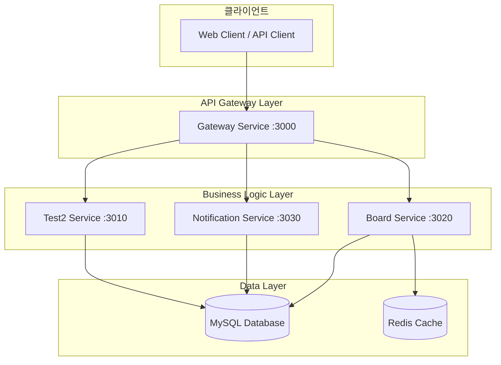
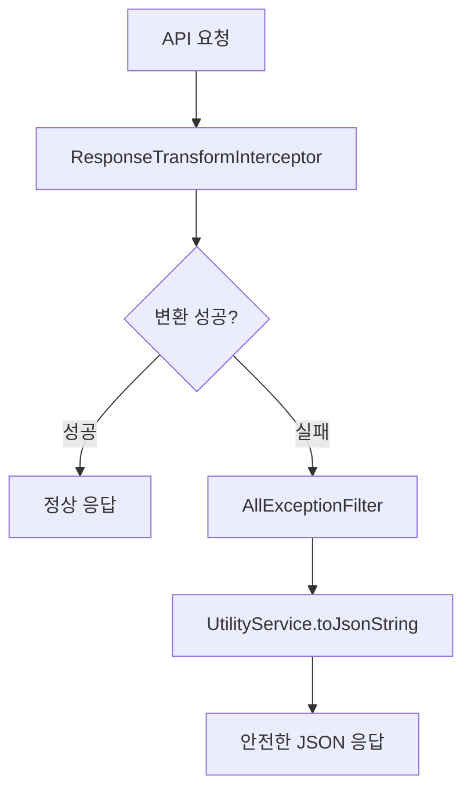
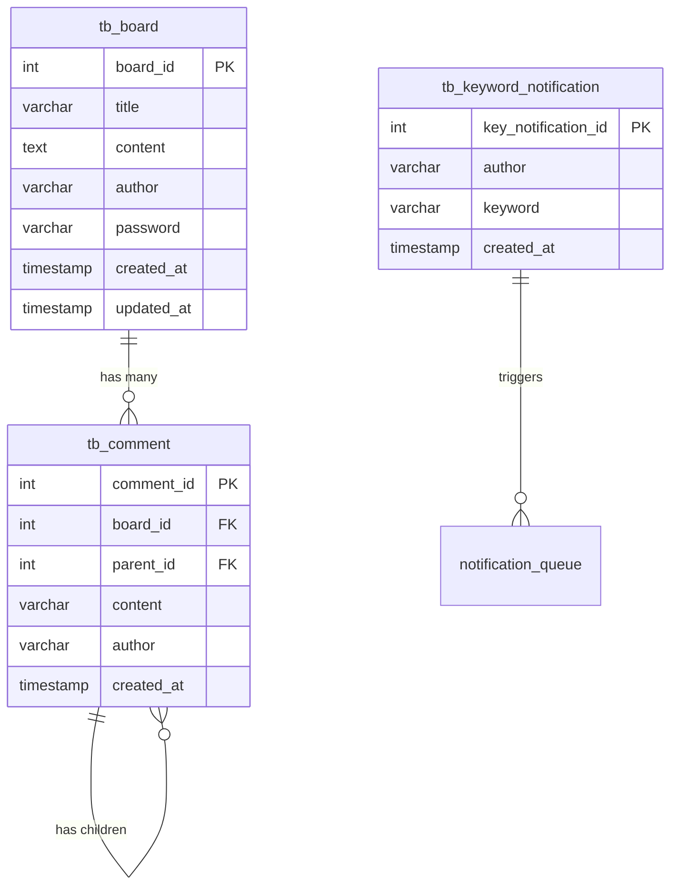
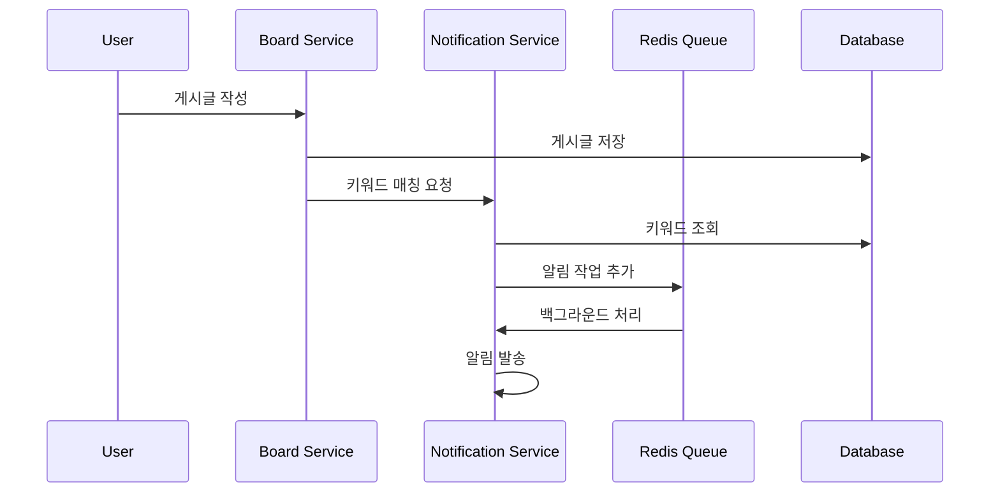

# 익명 게시판 및 키워드 알림 시스템

**NestJS v11 기반 마이크로서비스 아키텍처로 구현된 익명 게시판과 키워드 알림 시스템**

[](https://nodejs.org/)
[](https://nestjs.com/)
[](https://www.typescriptlang.org/)
[](https://pnpm.io/)
[](https://www.mysql.com/)
[](https://redis.io/)

## 🎯 프로젝트 개요

### 핵심 특징

- **🚀 완전 자동화된 응답 검증/변환 시스템**: `@CheckResponseWithType` 데코레이터 기반
- **🛡️ 3단계 에러 방어 시스템**: 안전한 JSON 직렬화 및 에러 처리
- **🏗️ 마이크로서비스 아키텍처**: Gateway 패턴으로 서비스 분리
- **⚡ 고성능 패키지 관리**: pnpm v8 + Node.js v22 최적화
- **🔒 타입 안전성**: 모든 DTO에 `@Type` 데코레이터 적용
- **📊 실시간 키워드 알림**: Redis Bull Queue 기반 비동기 처리

### 시스템 아키텍처



## 🚀 기술 스택

### 백엔드 프레임워크

- **NestJS v11**: 최신 프레임워크로 향상된 성능과 기능
- **Express v5**: 차세대 웹 프레임워크
- **TypeScript v5.1.3**: 강력한 타입 시스템

### 런타임 & 패키지 관리

- **Node.js v22 (LTS)**: 최신 LTS 버전으로 안정성과 성능 보장
- **pnpm v8**: 디스크 공간 절약과 빠른 설치 속도

### 빌드 시스템 & 성능 최적화

- **SWC 컴파일러**: TypeScript 컴파일러 대비 15.6% 빌드 성능 향상
- **자동 SWC 적용**: 모든 개발 서버에서 자동으로 SWC 사용
- **Webpack 5**: 최신 번들러로 최적화된 빌드

### 데이터베이스 & 캐싱

- **MySQL 8.0+**: 관계형 데이터베이스
- **TypeORM**: 강력한 ORM 라이브러리
- **Redis**: 캐싱 및 큐 시스템 (Bull Queue)

### 검증 & 변환

- **class-validator**: 자동 유효성 검증
- **class-transformer**: 객체 변환 및 직렬화
- **bcrypt**: 비밀번호 해시화

### API 문서화

- **Swagger**: 자동 API 문서 생성
- **OpenAPI 3.0**: 표준 API 스펙

## 📋 요구사항 명세

### 게시판 기능

- ✅ 게시글 CRUD (작성, 조회, 수정, 삭제)
- ✅ 비밀번호 기반 인증 (수정/삭제 시)
- ✅ 제목/작성자 검색 기능
- ✅ 페이징 지원
- ✅ 댓글 및 대댓글 시스템 (계층형 구조)

### 키워드 알림 기능

- ✅ 사용자별 키워드 등록
- ✅ 게시글/댓글 작성 시 자동 키워드 매칭
- ✅ 비동기 알림 처리 (Redis Queue)
- ✅ 중복 알림 방지

### 자동화 시스템

- ✅ **자동 응답 검증/변환**: `@CheckResponseWithType` 데코레이터
- ✅ **타입 안전성**: 런타임 타입 검증 및 변환
- ✅ **3단계 에러 방어**: 완벽한 에러 처리 시스템
- ✅ **성능 최적화**: 메타데이터 캐싱 및 최적화

## 🏗️ 프로젝트 구조

### 마이크로서비스 구조

```
toy-project/
├── apps/                           # 마이크로서비스 애플리케이션
│   ├── gateway/                    # API Gateway (:3000)
│   │   ├── src/
│   │   │   ├── gateway.controller.ts    # 메인 라우팅
│   │   │   ├── board.controller.ts      # 게시판 API 프록시
│   │   │   ├── health.controller.ts     # 헬스체크
│   │   │   └── main.ts                  # 진입점
│   │   └── test/                        # E2E 테스트
│   ├── board/                      # 게시판 서비스 (:3020)
│   │   ├── src/
│   │   │   ├── board.controller.ts      # TCP 컨트롤러
│   │   │   ├── board.service.ts         # 비즈니스 로직
│   │   │   └── main.ts                  # 마이크로서비스 진입점
│   │   └── test/                        # 단위/통합 테스트
│   ├── notification/               # 알림 서비스 (:3030)
│   │   ├── src/
│   │   │   ├── notification.controller.ts   # TCP 컨트롤러
│   │   │   ├── notification.service.ts      # 알림 로직
│   │   │   ├── notification.processor.ts    # 백그라운드 처리
│   │   │   └── main.ts                      # 진입점
│   │   └── test/                            # 테스트
│   └── test2/                      # 테스트 서비스 (:3010)
│       └── src/
├── libs/                           # 공유 라이브러리
│   ├── common/                     # 공통 기능
│   │   ├── constants/              # 상수 (RedisQueueName, SOURCE_TYPE)
│   │   ├── decorators/             # 데코레이터
│   │   │   ├── check-response.decorator.ts  # @CheckResponseWithType
│   │   │   └── transform.decorator.ts       # @NumberTransform, @StringTransform
│   │   ├── interceptors/           # 인터셉터
│   │   │   ├── interceptor.module.ts        # 인터셉터 모듈
│   │   │   └── response-transform.interceptor.ts  # 응답 변환
│   │   └── index.ts
│   ├── core/                       # 핵심 인프라
│   │   ├── config/                 # 설정 관리
│   │   │   ├── config.module.ts
│   │   │   └── config.service.ts
│   │   ├── filter/exception/       # 예외 필터
│   │   │   └── all-exception.filter.ts      # 글로벌 예외 처리
│   │   ├── redis/                  # Redis 모듈
│   │   │   └── redis.module.ts
│   │   └── index.ts
│   ├── database/                   # 데이터 계층 (도메인별 분리)
│   │   ├── board/                  # 게시판 도메인
│   │   │   ├── entities/           # 엔티티
│   │   │   │   ├── board.entity.ts
│   │   │   │   └── comment.entity.ts
│   │   │   └── repositories/       # 리포지토리
│   │   │       ├── board.repository.ts
│   │   │       └── comment.repository.ts
│   │   ├── common/                 # 공통 도메인
│   │   │   ├── entities/
│   │   │   │   ├── keyword-notification.entity.ts
│   │   │   │   └── test.entity.ts
│   │   │   └── repositories/
│   │   │       ├── keyword-notification.repository.ts
│   │   │       └── test.repository.ts
│   │   ├── database.module.ts      # 데이터베이스 모듈
│   │   └── database.service.ts     # 데이터베이스 서비스
│   ├── global-dto/                 # API 계약 (도메인별 분리)
│   │   └── board/
│   │       ├── request/            # 요청 DTO
│   │       │   ├── board-manage-request.ts
│   │       │   └── board-comment-manage.request.ts
│   │       └── response/           # 응답 DTO
│   │           ├── board-manage-response.ts
│   │           └── board-comment-manage-response.ts
│   ├── utility/                    # 유틸리티 (@Global 모듈)
│   │   ├── services/
│   │   │   └── utility.service.ts  # 공통 유틸리티 함수
│   │   └── utility.module.ts       # 글로벌 유틸리티 모듈
│   └── proxy/                      # 서비스 통신
│       └── common-proxy-client.ts  # MSA 통신 클라이언트
├── scripts/                        # 데이터베이스 스크립트
│   └── create-schema.sql           # 테이블 생성 스크립트
├── ssot/                          # Single Source of Truth 문서
│   ├── 01_System_Architecture.md   # 시스템 아키텍처
│   ├── 03_Database_Schema.md       # 데이터베이스 스키마
│   ├── 04_API_Interface.md         # API 인터페이스
│   └── 05_Package_Management.md    # 패키지 관리
├── package.json                    # 프로젝트 설정
├── nest-cli.json                   # NestJS CLI 설정
├── tsconfig.json                   # TypeScript 설정 (경로 별칭 포함)
└── README.md                       # 프로젝트 문서
```

### TypeScript 경로 별칭

```typescript
// tsconfig.json
{
  "paths": {
    "@app/common": ["libs/common/src"],
    "@app/core": ["libs/core/src"],
    "@app/database": ["libs/database/src"],
    "@app/global-dto": ["libs/global-dto/src"],
    "@app/utility": ["libs/utility/src"],
    "@app/proxy": ["libs/proxy/src"]
  }
}
```

## 🔧 자동화된 응답 검증/변환 시스템

### 🎯 핵심 특징

이 프로젝트의 가장 큰 특징은 **완전히 자동화된 응답 검증 및 변환 시스템**입니다.

#### **1. `@CheckResponseWithType` 데코레이터**

```typescript
// 컨트롤러에서 응답 타입 명시
@MessagePattern(CustomMessagePatterns.CreateBoard)
@CheckResponseWithType(CreateBoardResponse) // 👈 응답 타입 지정
async createBoard(@Payload() input: CreateBoardRequest): Promise<CreateBoardResponse> {
  return this.boardService.createBoard(input);
}
```

#### **2. 자동 타입 추출 및 변환**

```typescript
// ResponseTransformInterceptor가 자동으로 처리
export class ResponseTransformInterceptor implements NestInterceptor {
  async intercept(context: ExecutionContext, next: CallHandler) {
    const result = await next.handle().toPromise();

    // @CheckResponseWithType에서 지정한 타입 자동 추출
    const responseClass = this.reflector.get(
      'response-type',
      context.getHandler(),
    );

    if (responseClass) {
      // class-transformer로 자동 변환
      return plainToClass(responseClass, result, {
        excludeExtraneousValues: true, // @Expose() 필드만 포함
        enableImplicitConversion: true,
      });
    }

    return result;
  }
}
```

#### **3. 안전한 에러 처리**

```typescript
// UtilityService의 toJsonString으로 안전한 JSON 직렬화
export class UtilityService {
  toJsonString(obj: any, indent?: number): string {
    // 순환 참조, 함수, undefined 등을 안전하게 처리
    const seen = new WeakSet();

    return JSON.stringify(
      obj,
      (key, value) => {
        if (value === null || value === undefined) return null;
        if (typeof value === 'function') return '[Function]';
        if (typeof value === 'object' && seen.has(value)) return '[Circular]';
        if (typeof value === 'object') seen.add(value);
        return value;
      },
      indent,
    );
  }
}
```

### 🛡️ 3단계 에러 방어 시스템



1. **ResponseTransformInterceptor**: 자동 타입 변환 및 검증
2. **AllExceptionFilter**: 모든 예외의 최종 처리
3. **UtilityService**: 안전한 JSON 직렬화

### 🚀 사용법

#### **Response DTO 정의**

```typescript
export class CreateBoardResponse extends BoardModel {
  // BoardModel의 모든 필드 상속
  // @Expose() 데코레이터가 있는 필드만 응답에 포함
}

export class BoardModel {
  @ApiProperty({ description: '게시글 ID' })
  @Expose() // 👈 응답에 포함
  @Type(() => Number)
  @IsNumber()
  boardId: number;

  @ApiProperty({ description: '게시글 제목' })
  @Expose() // 👈 응답에 포함
  @Type(() => String)
  @StringTransform()
  @IsString()
  title: string;

  // password 필드는 @Expose() 없음 → 자동으로 응답에서 제외
  password: string;
}
```

#### **컨트롤러 구현**

```typescript
@Controller('board')
export class BoardController {
  @MessagePattern(CustomMessagePatterns.CreateBoard)
  @CheckResponseWithType(CreateBoardResponse) // 👈 이것만 추가하면 자동 처리
  async createBoard(
    @Payload() input: CreateBoardRequest,
  ): Promise<CreateBoardResponse> {
    return this.boardService.createBoard(input);
  }
}
```

### 🔒 보안 및 안정성

- **보안**: `@Expose()` 필드만 응답에 포함 (민감 정보 자동 차단)
- **타입 안전성**: 모든 필드의 타입 자동 변환 및 검증
- **에러 복구**: 검증 실패 시 안전한 에러 응답 반환
- **성능**: 메타데이터 캐싱으로 성능 최적화

## 💾 데이터베이스 스키마

### 테이블 구조

```sql
-- 게시글 테이블
CREATE TABLE IF NOT EXISTS tb_board (
  board_id INT AUTO_INCREMENT PRIMARY KEY,
  title VARCHAR(255) NOT NULL,
  content TEXT NOT NULL,
  author VARCHAR(50) NOT NULL,
  password VARCHAR(255) NOT NULL,
  created_at TIMESTAMP DEFAULT CURRENT_TIMESTAMP,
  updated_at TIMESTAMP DEFAULT CURRENT_TIMESTAMP ON UPDATE CURRENT_TIMESTAMP,
  INDEX idx_title (title),
  INDEX idx_author (author),
  INDEX idx_created_at (created_at)
);

-- 댓글 테이블 (계층형 구조)
CREATE TABLE IF NOT EXISTS tb_comment (
  comment_id INT AUTO_INCREMENT PRIMARY KEY,
  board_id INT NOT NULL,
  parent_id INT DEFAULT NULL,  -- 대댓글을 위한 부모 댓글 ID
  content VARCHAR(2000) NOT NULL,
  author VARCHAR(50) NOT NULL,
  created_at TIMESTAMP DEFAULT CURRENT_TIMESTAMP,
  FOREIGN KEY (board_id) REFERENCES tb_board(board_id) ON DELETE CASCADE,
  FOREIGN KEY (parent_id) REFERENCES tb_comment(comment_id) ON DELETE CASCADE,
  INDEX idx_board_id (board_id),
  INDEX idx_parent_id (parent_id)
);

-- 키워드 알림 테이블
CREATE TABLE IF NOT EXISTS tb_keyword_notification (
  key_notification_id INT AUTO_INCREMENT PRIMARY KEY,
  author VARCHAR(50) NOT NULL,
  keyword VARCHAR(100) NOT NULL,
  created_at TIMESTAMP DEFAULT CURRENT_TIMESTAMP,
  UNIQUE KEY unique_author_keyword (author, keyword),
  INDEX idx_author (author),
  INDEX idx_keyword (keyword)
);

-- 테스트 테이블
CREATE TABLE IF NOT EXISTS tb_test (
  id INT AUTO_INCREMENT PRIMARY KEY,
  name VARCHAR(255) NULL
);
```

### Entity 관계도



## 📦 설치 및 실행 방법

### 사전 요구사항

- **Node.js v22 (LTS)**: 최신 LTS 버전
- **pnpm v8**: 고성능 패키지 매니저
- **MySQL 8.0+**: 관계형 데이터베이스
- **Redis 6.0+**: 캐싱 및 큐 시스템

### 설치

1. **저장소 클론**

```bash
git clone https://github.com/kimhyosung1/toy-project.git
cd toy-project
```

2. **의존성 설치**

```bash
pnpm install
```

3. **환경 변수 설정**

```bash
# .env 파일 생성
cp .env.example .env
```

4. **.env 파일 수정**

```bash
# 서비스 포트 설정
GATEWAY_SERVICE_PORT=3000

# 마이크로서비스 설정
TEST2_SERVICE_HOST=127.0.0.1
TEST2_SERVICE_PORT=3010

BOARD_SERVICE_HOST=127.0.0.1
BOARD_SERVICE_PORT=3020

NOTIFICATION_SERVICE_HOST=127.0.0.1
NOTIFICATION_SERVICE_PORT=3030

# 데이터베이스 설정
DB_HOST=localhost
DB_PASSWORD=''
DB_USERNAME=root
DB_PORT=3306
DB_DATABASE=anonymous_board
DB_SYNC=false  # 프로덕션에서는 반드시 false

# Redis 설정
REDIS_HOST=localhost
REDIS_PORT=6379
```

5. **데이터베이스 초기화**

```bash
# MySQL 데이터베이스 생성
mysql -u root -p -e "CREATE DATABASE IF NOT EXISTS anonymous_board;"

# 테이블 생성
mysql -u root -p anonymous_board < scripts/create-schema.sql
```

### 실행

#### 개발 환경 (SWC 자동 적용)

각 서비스를 개별 터미널에서 실행 (모든 서비스에 SWC 자동 적용):

```bash
# 터미널 1: Gateway 서비스 (SWC 자동 적용)
pnpm run start:dev:gateway

# 터미널 2: Board 서비스 (SWC 자동 적용)
pnpm run start:dev:board

# 터미널 3: Notification 서비스 (SWC 자동 적용)
pnpm run start:dev:notification

# 터미널 4: Test2 서비스 (SWC 자동 적용, 선택사항)
pnpm run start:dev:debug:test2
```

**🚀 SWC 성능 향상:**

- **개발 서버 빌드**: 483ms (매우 빠름!)
- **핫 리로드**: 더욱 빠른 코드 변경 감지
- **자동 적용**: 별도 설정 없이 모든 개발 스크립트에서 SWC 사용

#### 프로덕션 환경

```bash
# SWC로 고성능 빌드 (권장)
pnpm run build:all:swc

# 또는 개별 앱 SWC 빌드
pnpm run build:swc gateway
pnpm run build:swc board
pnpm run build:swc notification

# 프로덕션 실행
pnpm run start:prod:gateway &
pnpm run start:prod:board &
pnpm run start:prod:notification &
```

**📊 SWC 빌드 성능:**

- **Webpack 컴파일**: 15.6% 성능 향상 (1710ms vs 2027ms)
- **전체 빌드**: 0.8% 성능 향상 (2.986초 vs 3.011초)
- **CI/CD 최적화**: 대규모 프로젝트에서 더 큰 성능 향상 기대

### 서비스 확인

- **Gateway API**: http://localhost:3000
- **Swagger 문서**: http://localhost:3000/api-docs
- **헬스체크**:
  - Gateway: http://localhost:3000/health-check
  - Board: http://localhost:3000/board/health-check
  - Notification: http://localhost:3000/notification/health-check

## 🧪 테스트

### 단위 테스트

```bash
# 전체 테스트 실행
pnpm test

# 특정 앱 테스트
pnpm test apps/board

# 특정 라이브러리 테스트
pnpm test libs/database

# 감시 모드
pnpm test:watch
```

### 커버리지 테스트

```bash
# 커버리지 포함 테스트
pnpm test:cov
```

### E2E 테스트

```bash
# E2E 테스트 실행
pnpm test:e2e
```

## 📊 API 문서

### Swagger UI

개발 서버 실행 후 다음 URL에서 API 문서를 확인할 수 있습니다:

- **Swagger UI**: http://localhost:3000/api-docs

### 주요 API 엔드포인트

#### 게시판 API

```http
# 게시글 작성
POST /boards
Content-Type: application/json

{
  "title": "게시글 제목",
  "content": "게시글 내용",
  "author": "작성자명",
  "password": "1234"
}

# 게시글 목록 조회 (페이징, 검색)
GET /boards?page=1&limit=10&title=검색어&author=작성자

# 게시글 수정
PUT /boards/:boardId
Content-Type: application/json

{
  "title": "수정된 제목",
  "content": "수정된 내용",
  "password": "1234"
}

# 게시글 삭제
DELETE /boards/:boardId
Content-Type: application/json

{
  "password": "1234"
}
```

#### 댓글 API

```http
# 댓글 작성
POST /boards/:boardId/comments
Content-Type: application/json

{
  "content": "댓글 내용",
  "author": "작성자명",
  "parentId": null  // 대댓글인 경우 부모 댓글 ID
}

# 댓글 목록 조회
GET /boards/:boardId/comments?page=1&limit=10
```

## 🔄 키워드 알림 시스템

### 동작 원리

1. **게시글/댓글 작성 시 자동 실행**
2. **키워드 매칭**: 제목 + 내용에서 등록된 키워드 검색
3. **비동기 처리**: Redis Bull Queue를 통한 백그라운드 처리
4. **알림 발송**: 매칭된 키워드별로 개별 알림 생성

### 키워드 매칭 플로우



### 테스트용 키워드 데이터

```sql
-- 초기 키워드 데이터
INSERT INTO tb_keyword_notification (author, keyword) VALUES
('홍길동', '테스트'),
('홍길동', '안녕'),
('김철수', '프로젝트'),
('이영희', '게시판'),
('이영희', '코딩');
```

## 🛠️ 개발 가이드

### 새로운 API 추가

1. **DTO 정의**

```typescript
// Request DTO
export class CreateSomethingRequest {
  @IsNotEmpty()
  @MaxLength(255)
  @Type(() => String)
  @StringTransform()
  name: string;
}

// Response DTO
export class CreateSomethingResponse {
  @Expose()
  @Type(() => Number)
  id: number;

  @Expose()
  @Type(() => String)
  name: string;
}
```

2. **컨트롤러 구현**

```typescript
@Controller('something')
export class SomethingController {
  @MessagePattern('create_something')
  @CheckResponseWithType(CreateSomethingResponse) // 👈 자동 변환 활성화
  async create(
    @Payload() dto: CreateSomethingRequest,
  ): Promise<CreateSomethingResponse> {
    return this.service.create(dto);
  }
}
```

3. **자동으로 처리되는 것들**
   - 타입 변환 및 검증
   - 응답 직렬화
   - 에러 처리
   - API 문서 생성

### 빌드 및 개발 명령어

```bash
# 개발 서버 (SWC 자동 적용)
pnpm run start:dev:board        # Board 서비스
pnpm run start:dev:gateway      # Gateway 서비스
pnpm run start:dev:notification # Notification 서비스

# 빌드 (SWC 권장)
pnpm run build:all:swc          # 모든 앱 SWC 빌드
pnpm run build:swc board        # 개별 앱 SWC 빌드

# 기존 방식 (호환성)
pnpm run build:all              # 모든 앱 기존 빌드
pnpm run build board            # 개별 앱 기존 빌드
```

### 코드 품질 관리

```bash
# 코드 포매팅
pnpm run format

# 린트 검사 및 자동 수정
pnpm run lint

# 타입 체크 (SWC 빌드로 빠른 검증)
pnpm run build:swc gateway
```

## 🚀 성능 최적화

### SWC 컴파일러 최적화

- **빌드 성능**: Webpack 컴파일 15.6% 향상 (1710ms vs 2027ms)
- **개발 서버**: 483ms 초고속 빌드
- **자동 적용**: 모든 개발 스크립트에서 SWC 자동 사용
- **호환성**: 기존 TypeScript 컴파일러와 100% 동일한 결과물

### pnpm 최적화

- **디스크 공간 절약**: 심볼릭 링크를 통한 중복 제거
- **빠른 설치**: npm/yarn 대비 2-3배 빠른 속도
- **효율적인 캐시**: 글로벌 저장소 활용

### 데이터베이스 최적화

- **인덱스 최적화**: 검색 성능 향상
- **페이징**: 대용량 데이터 효율적 처리
- **연관 관계**: N+1 문제 방지

### 비동기 처리

- **Redis Queue**: 알림 처리 비동기화
- **Background Jobs**: 시스템 응답성 향상

## 🔒 보안 고려사항

### 입력 데이터 검증

- **class-validator**: 자동 유효성 검증
- **SQL Injection 방지**: TypeORM 사용
- **XSS 방지**: 입력 데이터 이스케이프

### 비밀번호 보안

- **bcrypt 해시**: 단방향 암호화 (salt 자동 생성)
- **평문 저장 금지**: 해시된 값만 저장
- **응답 제외**: `@Expose()` 없는 필드 자동 제외

### 에러 정보 보안

- **프로덕션 모드**: 상세 에러 스택 숨김
- **민감 정보 제외**: 로그에서 민감 정보 차단

## 📈 모니터링 및 로깅

### 헬스체크 엔드포인트

- Gateway: `GET /health-check`
- Board: `GET /board/health-check`
- Notification: `GET /notification/health-check`
- Test2: `GET /test2/health-check`

### 로깅 시스템

```typescript
// 성공 로그
console.log(`✅ Response validated [${controllerName}.${methodName}]`);

// 에러 로그
console.error(
  `❌ Validation failed [${controllerName}.${methodName}]:`,
  this.utilityService.toJsonString(errors, 2),
);
```

## 🔮 향후 계획

### 기능 확장

- **인증/인가 시스템**: JWT 기반 사용자 인증
- **파일 업로드**: 이미지 첨부 기능
- **실시간 알림**: WebSocket 기반 실시간 알림
- **API 버전 관리**: v1, v2 API 지원

### 기술 업그레이드

- **NestJS v12**: 차기 버전 업그레이드
- **TypeScript v5.2+**: 최신 기능 활용
- **Docker 컨테이너화**: 배포 환경 표준화

### 성능 개선

- **캐싱 전략**: Redis 기반 데이터 캐싱
- **CDN 도입**: 정적 자원 최적화
- **로드 밸런싱**: 트래픽 분산 처리

## 📞 문의 및 지원

### 문서

- **시스템 아키텍처**: [ssot/01_System_Architecture.md](./ssot/01_System_Architecture.md)
- **데이터베이스 스키마**: [ssot/03_Database_Schema.md](./ssot/03_Database_Schema.md)
- **API 인터페이스**: [ssot/04_API_Interface.md](./ssot/04_API_Interface.md)
- **패키지 관리**: [ssot/05_Package_Management.md](./ssot/05_Package_Management.md)
- **SWC 빌드 가이드**: [swc-build-guide.md](./swc-build-guide.md)
- **빌드 성능 비교**: [build-performance-comparison.md](./build-performance-comparison.md)

### 기술 지원

- **이슈 리포트**: GitHub Issues
- **기능 요청**: GitHub Discussions
- **보안 취약점**: 비공개 이메일 연락

---

**Made with ❤️ using NestJS v11, Node.js v22, and pnpm v8**
