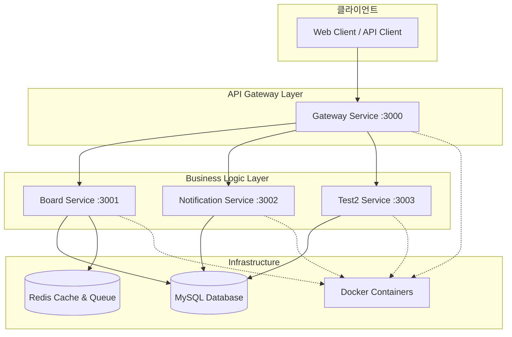

# 익명 게시판 및 키워드 알림 시스템

[](https://nodejs.org/)
[](https://nestjs.com/)
[](https://www.typescriptlang.org/)
[](https://pnpm.io/)
[](https://www.docker.com/)

**NestJS v11 기반 마이크로서비스 아키텍처로 구현된 익명 게시판과 키워드 알림 시스템**

## 🎯 프로젝트 개요

### 핵심 특징

- **🚀 완전 자동화된 응답 검증/변환 시스템**: `@CheckResponseWithType` 데코레이터 기반
- **🛡️ 3단계 에러 방어 시스템**: 안전한 JSON 직렬화 및 예외 처리
- **🏗️ 마이크로서비스 아키텍처**: Gateway 패턴으로 서비스 분리
- **🐳 Docker 컨테이너화**: 일관된 개발/운영 환경
- **⚡ 고성능 최적화**: SWC 컴파일러 + pnpm v8
- **📊 실시간 키워드 알림**: Redis Bull Queue 기반 비동기 처리

### 시스템 아키텍처



## 🚀 빠른 시작

### Docker로 실행 (권장)

```bash
# 1. 저장소 클론
git clone https://github.com/kimhyosung1/toy-project.git
cd toy-project

# 2. 실행 권한 부여
chmod +x docker.sh

# 3. 애플리케이션 빌드
pnpm run build:all:swc

# 4. Docker로 전체 시스템 시작
./docker.sh dev up -d

# 5. 상태 확인
./docker.sh dev ps
```

### 로컬 개발 환경

```bash
# 1. 의존성 설치
pnpm install

# 2. 환경변수 확인 (env/dev.env)
# 기본 설정으로 바로 실행 가능하지만, 필요시 수정
cat env/dev.env

# 3. 각 서비스를 개별 터미널에서 실행
pnpm run start:dev:gateway      # 터미널 1
pnpm run start:dev:board        # 터미널 2
pnpm run start:dev:notification # 터미널 3
```

### 서비스 확인

- **Gateway API**: http://localhost:3000
- **Swagger 문서**: http://localhost:3000/api-docs
- **헬스체크**: http://localhost:3000/health-check

## ⚙️ 환경 설정

### 환경변수 구성

프로젝트는 `env/` 폴더의 환경별 설정 파일을 사용합니다:

```bash
env/
├── dev.env     # 개발 환경 (기본값)
├── qa.env      # QA 환경
└── prod.env    # 프로덕션 환경
```

### 개발 환경 설정 예시 (env/dev.env)

```bash
# 개발 환경 설정
NODE_ENV=dev
COMPOSE_PROJECT_NAME=toy-project-dev

# 서비스 포트
GATEWAY_SERVICE_PORT=3000
BOARD_SERVICE_PORT=3001
NOTIFICATION_SERVICE_PORT=3002
TEST2_SERVICE_PORT=3003

# 데이터베이스 (로컬)
DB_HOST=localhost
DB_PORT=3306
DB_USERNAME=root
DB_PASSWORD=
DB_DATABASE=public
MYSQL_ROOT_PASSWORD=rootpassword

# Redis (로컬)
REDIS_HOST=localhost
REDIS_PORT=6379
```

> 💡 **참고**: 기본 설정으로 바로 실행 가능합니다. MySQL과 Redis는 외부 서비스로 사용하므로 로컬에 설치되어 있어야 합니다.

## 🏗️ 기술 스택

### 백엔드 & 런타임

- **NestJS v11**: 최신 프레임워크
- **TypeScript v5.1.3**: 강력한 타입 시스템
- **Node.js v22**: 최신 LTS 버전
- **SWC 컴파일러**: 15.6% 빌드 성능 향상

### 데이터베이스 & 캐싱

- **MySQL 8.0+**: 관계형 데이터베이스
- **TypeORM**: ORM 라이브러리
- **Redis**: 캐싱 및 큐 시스템

### 인프라 & 도구

- **Docker + Docker Compose**: 컨테이너화
- **pnpm v8**: 고성능 패키지 매니저
- **Swagger**: API 문서화

## 📚 상세 문서 (SSOT)

### 🔧 시스템 설계 및 아키텍처

- **[📋 PRD (Product Requirements Document)](./ssot/01_PRD.md)**: 프로젝트 요구사항 및 기능 명세
- **[🏗️ 시스템 아키텍처](./ssot/01_System_Architecture.md)**: 마이크로서비스 구조 및 설계 원칙
- **[🔄 사용자 플로우](./ssot/02_UserFlow.md)**: 사용자 경험 및 워크플로우

### 🌐 API 및 데이터베이스

- **[📡 API 인터페이스](./ssot/04_API_Interface.md)**: REST API 명세서 및 사용법
- **[🗄️ 데이터베이스 스키마](./ssot/03_Database_Schema.md)**: 테이블 구조 및 관계도

### 🚀 개발 및 배포

- **[📦 패키지 관리](./ssot/05_Package_Management.md)**: pnpm 및 의존성 관리
- **[⚡ SWC 빌드 시스템](./ssot/06_SWC_Build_System.md)**: 고성능 빌드 설정
- **[🐳 Docker 구성](./ssot/07_Docker_Configuration.md)**: 컨테이너화 및 배포 가이드

### 📖 통합 가이드

- **[📝 전체 프로젝트 가이드](./ssot/00_README.md)**: 완전한 프로젝트 문서

## 🛠️ 개발 명령어

### 개발 서버 (SWC 자동 적용)

```bash
pnpm run start:dev:gateway      # Gateway 서비스
pnpm run start:dev:board        # Board 서비스
pnpm run start:dev:notification # Notification 서비스
```

### 빌드

```bash
pnpm run build:all:swc          # 모든 앱 SWC 빌드 (권장)
pnpm run build:all              # 모든 앱 기존 빌드
```

### Docker 관리

```bash
./docker.sh dev up -d           # 개발 환경 시작
./docker.sh dev logs gateway    # 로그 확인
./docker.sh dev down            # 서비스 중지
```

### 테스트

```bash
pnpm test                       # 단위 테스트
pnpm test:e2e                   # E2E 테스트
pnpm test:cov                   # 커버리지 테스트
```

## 📊 주요 API 엔드포인트

### 시스템 API

- `GET /health-check` - Gateway 헬스체크
- `GET /health` - 시스템 상태 확인
- `GET /api-docs` - Swagger API 문서

### 게시판 API

- `POST /boards` - 게시글 작성
- `GET /boards` - 게시글 목록 조회 (페이징, 검색)
- `PUT /boards/:id` - 게시글 수정 (비밀번호 인증)
- `DELETE /boards/:id` - 게시글 삭제 (비밀번호 인증)

### 댓글 API

- `POST /boards/:id/comments` - 댓글/대댓글 작성
- `GET /boards/:id/comments` - 댓글 목록 조회 (계층형)

> 📖 **상세한 API 명세**: [API 인터페이스 문서](./ssot/04_API_Interface.md) 참조

## 🔧 주요 기능

### 🤖 자동화된 응답 시스템

```typescript
@MessagePattern(CustomMessagePatterns.CreateBoard)
@CheckResponseWithType(CreateBoardResponse) // 👈 자동 변환 활성화
async createBoard(@Payload() input: CreateBoardRequest): Promise<CreateBoardResponse> {
  return this.boardService.createBoard(input);
}
```

### 🛡️ 3단계 에러 방어

1. **ResponseTransformInterceptor**: 자동 타입 변환 및 검증
2. **AllExceptionFilter**: 모든 예외의 최종 처리
3. **UtilityService**: 안전한 JSON 직렬화

### 📊 키워드 알림 시스템

- 게시글/댓글 작성 시 자동 키워드 매칭
- Redis Bull Queue 기반 비동기 처리
- 실시간 알림 발송

## 📈 성능 최적화

### SWC 컴파일러

- **빌드 성능**: 15.6% 향상 (1710ms vs 2027ms)
- **개발 서버**: 483ms 초고속 빌드
- **자동 적용**: 모든 개발 스크립트에서 SWC 사용

### pnpm 패키지 관리

- **빠른 설치**: npm/yarn 대비 2-3배 빠른 속도
- **디스크 절약**: 심볼릭 링크를 통한 중복 제거
- **효율적 캐시**: 글로벌 저장소 활용

### Docker 최적화

- **멀티스테이지 빌드**: 최종 이미지 크기 최소화
- **pnpm 8.15.6 고정**: 일관된 의존성 관리
- **Alpine Linux**: 경량 베이스 이미지

## 🔒 보안 기능

### 입력 데이터 보안

- **class-validator**: 자동 유효성 검증
- **SQL Injection 방지**: TypeORM 사용
- **XSS 방지**: 입력 데이터 이스케이프

### 비밀번호 보안

- **bcrypt 해시**: 단방향 암호화
- **응답 제외**: `@Expose()` 없는 필드 자동 제외
- **salt 자동 생성**: 레인보우 테이블 공격 방지

## 🐳 Docker 활용

### 간편한 컨테이너 관리

```bash
# 전체 시스템 시작
./docker.sh dev up -d

# 특정 서비스만 시작
./docker.sh dev gateway

# 로그 확인
./docker.sh dev logs -f gateway

# 상태 확인
docker ps
```

### 환경별 배포

```bash
./docker.sh dev up -d      # 개발 환경
./docker.sh qa up -d       # QA 환경
./docker.sh prod up -d     # 프로덕션 환경
```

## 🧪 테스트

### 단위 테스트

```bash
pnpm test                   # 전체 테스트
pnpm test apps/board        # 특정 앱 테스트
pnpm test:watch             # 감시 모드
```

### API 테스트

```bash
# Swagger UI 사용
http://localhost:3000/api-docs

# cURL 사용
curl http://localhost:3000/health-check
curl -X POST http://localhost:3000/boards -H "Content-Type: application/json" -d '{"title":"테스트","content":"내용","author":"작성자","password":"1234"}'
```

## 🔮 향후 계획

### 기능 확장

- **JWT 인증**: 사용자 인증 체계
- **파일 업로드**: 이미지 첨부 기능
- **실시간 알림**: WebSocket 기반 푸시 알림
- **API 버전 관리**: v1, v2 병렬 지원

### 기술 업그레이드

- **Kubernetes**: 컨테이너 오케스트레이션
- **CI/CD**: GitHub Actions 자동화
- **모니터링**: Prometheus + Grafana

## 📞 문의 및 지원

### 기술 문서

- **완전한 가이드**: [전체 프로젝트 문서](./ssot/00_README.md)
- **아키텍처**: [시스템 아키텍처](./ssot/01_System_Architecture.md)
- **API 가이드**: [API 인터페이스](./ssot/04_API_Interface.md)
- **Docker 가이드**: [Docker 구성](./ssot/07_Docker_Configuration.md)

### 개발 지원

- **이슈 리포트**: GitHub Issues
- **기능 요청**: GitHub Discussions
- **문서 업데이트**: Pull Requests

---

**Made with ❤️ using NestJS v11, Node.js v22, Docker, and pnpm v8**

> 📚 **더 자세한 정보**: [SSOT 문서 폴더](./ssot/)에서 전체 프로젝트 문서를 확인하세요.
