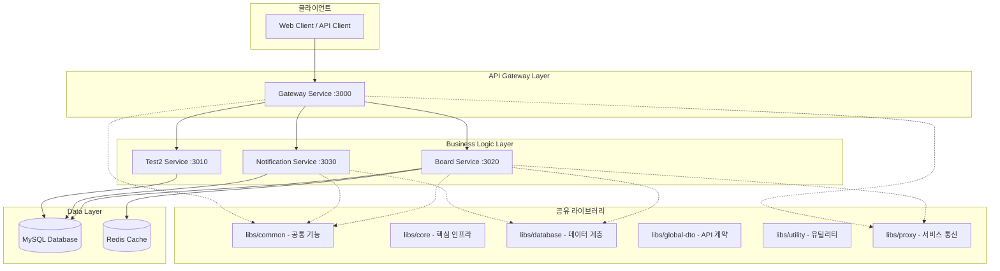
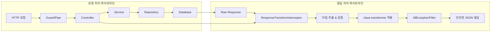
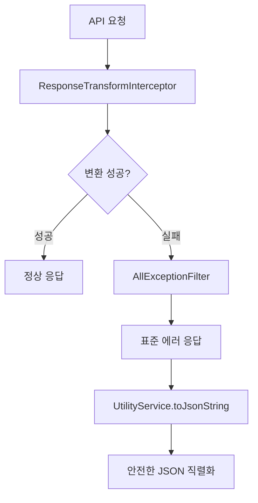
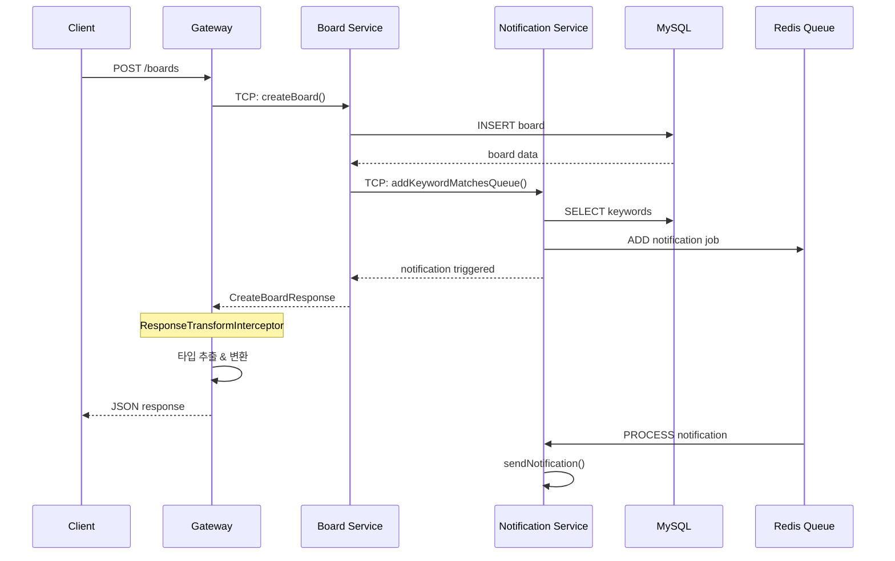
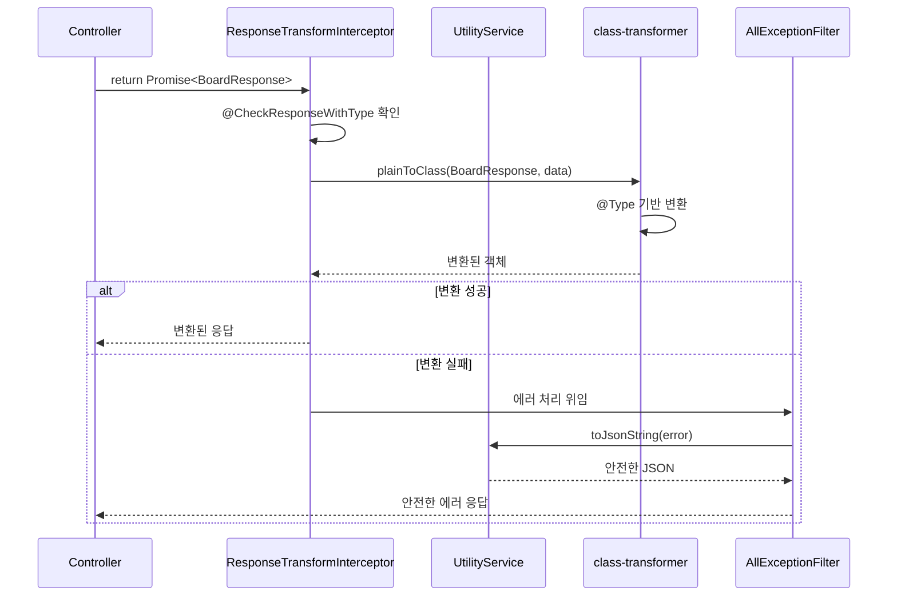

# System Architecture - 익명 게시판 및 키워드 알림 시스템

## 🏗️ 시스템 개요

**프로젝트명**: 익명 게시판 및 키워드 알림 시스템  
**아키텍처**: Microservice Architecture (MSA)  
**개발 프레임워크**: NestJS v11  
**런타임**: Node.js v22 (LTS)  
**언어**: TypeScript  
**컴파일러**: SWC (15.6% 성능 향상)  
**데이터베이스**: MySQL + TypeORM  
**캐싱**: Redis (Bull Queue)  
**통신 프로토콜**: HTTP (외부), TCP (내부)  
**패키지 매니저**: pnpm v8

## 🎯 설계 원칙

### 1. 자동화 우선 (Automation First)

- **완전 자동화된 응답 검증/변환 시스템**
- **제로 설정**: 하드코딩 없는 동적 타입 추출
- **자동 에러 처리**: 3단계 방어 시스템

### 2. 타입 안전성 (Type Safety)

- **모든 DTO에 `@Type` 데코레이터 적용**
- **런타임 타입 검증 및 변환**
- **TypeScript 메타데이터 활용**

### 3. 마이크로서비스 분리 (Service Separation)

- **단일 책임 원칙** 기반 서비스 분리
- **독립적 배포 및 확장** 가능
- **장애 격리** 및 복구 지원

### 4. 보안 및 안정성 (Security & Reliability)

- **3단계 에러 방어 시스템**
- **자동 민감정보 차단** (`@Expose()` 기반)
- **입력 검증 자동화** (`class-validator`)

## 🏛️ 마이크로서비스 구조



## 🔧 자동화된 응답 검증/변환 시스템

### 📋 시스템 구성도



### 🎯 핵심 구성 요소

#### 1. **@CheckResponseWithType 데코레이터**

```typescript
@CheckResponseWithType(SelectBoardResponse)
async findAllBoards(input: SelectBoardRequest): Promise<SelectBoardResponse> {
  return this.boardService.findAllBoards(input);
}
```

**동작 원리**:

- 클래스 메타데이터에 검증 활성화 마킹
- `ResponseTransformInterceptor`에서 자동 감지
- 런타임에 동적 타입 추출 및 변환 수행

#### 2. **ResponseTransformInterceptor**

```typescript
@Injectable()
export class ResponseTransformInterceptor implements NestInterceptor {
  constructor(
    private reflector: Reflector,
    private readonly utilityService: UtilityService,
  ) {}

  async intercept(context: ExecutionContext, next: CallHandler) {
    const result = await next.handle().toPromise();

    // 1. @CheckResponseWithType 데코레이터 확인
    const responseClass = this.reflector.get(
      'response-type',
      context.getHandler(),
    );

    if (responseClass) {
      // 2. class-transformer로 자동 변환
      return plainToClass(responseClass, result, {
        excludeExtraneousValues: true,
        enableImplicitConversion: true,
      });
    }

    return result;
  }
}
```

### 🛡️ 3단계 에러 방어 시스템



#### **1단계: ResponseTransformInterceptor**

- 자동 타입 변환 및 검증
- 변환 실패 시 다음 단계로 전달

#### **2단계: AllExceptionFilter**

- 모든 예외의 최종 처리
- 표준화된 에러 응답 형식 보장
- `UtilityService.toJsonString`으로 안전한 JSON 직렬화

#### **3단계: UtilityService**

- 순환 참조, 함수, undefined 등을 안전하게 처리
- 에러 객체의 완전한 직렬화 지원

## 🏢 서비스별 상세 구조

### 1. Gateway Service (:3000)

**역할**: API 라우팅 및 외부 인터페이스 제공

**구성요소**:

```typescript
apps/gateway/src/
├── main.ts                    # 애플리케이션 진입점
├── gateway.module.ts          # 메인 모듈
├── gateway.controller.ts      # API 라우팅
├── board.controller.ts        # 게시판 API 라우팅
└── health.controller.ts       # 헬스체크
```

**주요 기능**:

- HTTP → TCP 프로토콜 변환
- API 문서화 (Swagger)
- 요청 라우팅 및 응답 집계
- CORS 설정 및 보안 헤더

### 2. Board Service (:3020)

**역할**: 게시판 및 댓글 비즈니스 로직 처리

**구성요소**:

```typescript
apps/board/src/
├── main.ts                    # 마이크로서비스 진입점
├── board.module.ts            # 게시판 모듈
├── board.controller.ts        # TCP 컨트롤러
└── board.service.ts           # 비즈니스 로직
```

**주요 기능**:

- 게시글 CRUD operations
- 댓글 및 대댓글 관리
- 비밀번호 검증 (bcrypt)
- 키워드 알림 트리거
- 페이징 및 검색

### 3. Notification Service (:3030)

**역할**: 키워드 기반 알림 처리

**구성요소**:

```typescript
apps/notification/src/
├── main.ts                    # 마이크로서비스 진입점
├── notification.module.ts     # 알림 모듈
├── notification.controller.ts # TCP 컨트롤러
├── notification.service.ts    # 알림 비즈니스 로직
└── notification.processor.ts  # 백그라운드 처리
```

**주요 기능**:

- 키워드 매칭 엔진
- 비동기 알림 처리 (Bull Queue)
- 알림 이력 관리
- 중복 알림 방지

### 4. Test2 Service (:3010)

**역할**: 테스트 및 개발용 서비스

**구성요소**:

```typescript
apps/test2/src/
├── main.ts                    # 마이크로서비스 진입점
├── test2.module.ts            # 테스트 모듈
├── test2.controller.ts        # TCP 컨트롤러
└── test2.service.ts           # 테스트 로직
```

## 📚 공유 라이브러리 구조

### 1. libs/common - 공통 기능

```typescript
libs/common/src/
├── constants/
│   └── constants.ts                 # 상수 정의 (RedisQueueName, SOURCE_TYPE)
├── decorators/
│   ├── check-response.decorator.ts  # @CheckResponseWithType 데코레이터
│   └── transform.decorator.ts       # @NumberTransform, @StringTransform
├── interceptors/
│   ├── interceptor.module.ts        # 인터셉터 모듈
│   └── response-transform.interceptor.ts  # 응답 변환
└── index.ts                         # 공통 기능 export
```

### 2. libs/core - 핵심 인프라

```typescript
libs/core/src/
├── config/
│   ├── config.module.ts             # 설정 모듈
│   ├── config.service.ts            # 설정 관리
│   └── index.ts
├── filter/
│   └── exception/
│       └── all-exception.filter.ts  # 글로벌 예외 필터
├── redis/
│   ├── redis.module.ts              # Redis 모듈
│   └── index.ts
└── index.ts                         # 핵심 기능 export
```

### 3. libs/database - 데이터 계층

```typescript
libs/database/src/
├── board/                           # 게시판 도메인
│   ├── entities/
│   │   ├── board.entity.ts
│   │   ├── comment.entity.ts
│   │   └── index.ts
│   ├── repositories/
│   │   ├── board.repository.ts
│   │   ├── comment.repository.ts
│   │   └── index.ts
│   └── index.ts
├── common/                          # 공통 도메인
│   ├── entities/
│   │   ├── keyword-notification.entity.ts
│   │   ├── test.entity.ts
│   │   └── index.ts
│   ├── repositories/
│   │   ├── keyword-notification.repository.ts
│   │   ├── test.repository.ts
│   │   └── index.ts
│   └── index.ts
├── database.module.ts               # 데이터베이스 모듈
├── database.service.ts              # 데이터베이스 서비스
└── index.ts                         # 데이터 계층 export
```

### 4. libs/global-dto - API 계약

```typescript
libs/global-dto/src/
├── board/
│   ├── request/
│   │   ├── board-manage-request.ts      # 게시판 요청 DTO
│   │   ├── board-comment-manage.request.ts  # 댓글 요청 DTO
│   │   └── index.ts
│   └── response/
│       ├── board-manage-response.ts     # 게시판 응답 DTO
│       ├── board-comment-manage-response.ts # 댓글 응답 DTO
│       └── index.ts
└── index.ts                             # 글로벌 DTO export
```

### 5. libs/utility - 유틸리티

```typescript
libs/utility/src/
├── services/
│   ├── utility.service.ts           # 유틸리티 서비스
│   └── index.ts
├── utility.module.ts                # 유틸리티 모듈 (@Global)
└── index.ts                         # 유틸리티 export
```

**주요 기능**:

- `toJsonString`: 안전한 JSON 직렬화
- `parseJsonString`: JSON 파싱
- `toCamelCase`: 카멜케이스 변환
- `maskString`: 문자열 마스킹
- `getCurrentTimestamp`: 현재 타임스탬프
- `toKoreanTime`: 한국 시간 변환
- `isValidEmail`: 이메일 검증
- `generateRandomString`: 랜덤 문자열 생성

### 6. libs/proxy - 서비스 통신

```typescript
libs/proxy/src/
└── common-proxy-client.ts           # MSA 통신 클라이언트
```

**주요 기능**:

- 마이크로서비스 간 TCP 통신
- 클라이언트 팩토리 패턴
- 메시지 패턴 정의

## 🔄 데이터 플로우

### 1. 게시글 작성 플로우



### 2. 자동 검증/변환 플로우



## 🛡️ 보안 아키텍처

### 1. 응답 보안

```typescript
// 민감 정보 자동 차단
export class BoardModel {
  @Expose()
  boardId: number;

  @Expose()
  title: string;

  password: string; // @Expose() 없음 → 응답에서 자동 제외
}
```

### 2. 입력 검증

```typescript
// 자동 타입 변환 + 검증
export class CreateBoardRequest {
  @Type(() => String) // 1. 타입 변환
  @StringTransform() // 2. 커스텀 변환 (공백 제거 등)
  @IsString() // 3. 유효성 검증
  @MaxLength(255) // 4. 길이 제한
  title: string;
}
```

### 3. 비밀번호 보안

- **bcrypt 해싱**: 단방향 암호화
- **salt rounds**: 보안 강도 조절
- **자동 제외**: 응답에서 비밀번호 필드 차단

## 📊 성능 최적화

### 1. 캐싱 전략

```typescript
// TypeScript 메타데이터 캐싱
class TypeCache {
  private static cache = new Map<string, any>();

  static get(key: string): any {
    return this.cache.get(key);
  }

  static set(key: string, value: any): void {
    this.cache.set(key, value);
  }
}
```

### 2. 데이터베이스 최적화

- **인덱스 최적화**: 검색 성능 향상
- **연관 관계 최적화**: N+1 문제 방지
- **페이징**: 대용량 데이터 처리

### 3. 비동기 처리

- **Redis Queue**: 알림 처리 비동기화
- **Background Jobs**: 시스템 응답성 향상

## 🔮 확장성 설계

### 1. 수평 확장

```yaml
# Docker Compose 예시
version: '3.8'
services:
  gateway:
    replicas: 2
    ports:
      - '3000-3001:3000'

  board:
    replicas: 3
    ports:
      - '3020-3022:3020'

  notification:
    replicas: 2
    ports:
      - '3030-3031:3030'
```

### 2. 새로운 서비스 추가

1. **새 서비스 생성**

```bash
nest generate app new-service
```

2. **DTO 정의 + @CheckResponseWithType 적용**

```typescript
@CheckResponseWithType(NewServiceResponse)
export class NewServiceResponse {
  @Expose()
  @Type(() => String)
  data: string;
}
```

3. **자동으로 검증/변환 시스템 적용됨**

## 🚨 장애 대응

### 1. 서비스 격리

- 각 마이크로서비스 독립 운영
- 장애 시 다른 서비스에 영향 최소화
- Circuit Breaker 패턴 적용 가능

### 2. 에러 복구

```typescript
// 3단계 에러 방어로 안전한 응답 보장
try {
  return await this.transform(data);
} catch (transformError) {
  return this.utilityService.toJsonString(transformError, 2);
}
```

### 3. 모니터링

- 각 서비스별 헬스체크 엔드포인트
- 응답 시간 및 에러율 모니터링
- 자동 알림 및 복구 시스템

## 🔧 개발 및 배포

### 1. 개발 환경 (SWC 자동 적용)

```bash
# 개발 서버 실행 (모든 서비스에 SWC 자동 적용)
pnpm run start:dev:gateway      # Gateway (SWC)
pnpm run start:dev:board        # Board (SWC)
pnpm run start:dev:notification # Notification (SWC)

# SWC 성능 향상
# - 개발 서버 빌드: 483ms (초고속)
# - 핫 리로드: 더욱 빠른 코드 변경 감지
pnpm run start:dev:gateway     # Gateway :3000
pnpm run start:dev:board       # Board :3020
pnpm run start:dev:notification # Notification :3030
pnpm run start:dev:debug:test2  # Test2 :3010
```

### 2. 테스트 전략

- **단위 테스트**: 각 서비스별 로직 검증
- **통합 테스트**: 서비스 간 통신 검증
- **E2E 테스트**: 전체 플로우 검증
- **자동화 테스트**: 검증/변환 시스템 테스트

### 3. 배포 전략

- **Blue-Green 배포**: 무중단 배포
- **Canary 배포**: 점진적 배포
- **롤백 지원**: 빠른 장애 복구

## ⚠️ 주의사항

### 1. 시스템 요구사항

- **Node.js**: v22 (LTS) 이상
- **MySQL**: 5.7 이상
- **Redis**: 6.0 이상
- **메모리**: 서비스당 최소 512MB

### 2. 개발 시 고려사항

- **타입 정의**: 모든 DTO에 `@Type` 데코레이터 필수
- **응답 DTO**: `@CheckResponseWithType` 데코레이터 적용 필수
- **에러 처리**: 3단계 방어 시스템 신뢰
- **성능**: 캐싱 시스템 활용

### 3. 운영 시 고려사항

- **포트 충돌**: 각 서비스별 포트 분리
- **환경 변수**: 서비스별 설정 관리
- **로그 레벨**: 환경별 적절한 설정
- **백업**: 데이터베이스 정기 백업

## 📈 메트릭 및 모니터링

### 1. 성능 지표

- **응답 시간**: API 엔드포인트별 측정
- **처리량**: TPS (Transactions Per Second)
- **에러율**: 서비스별 에러 발생률
- **변환 성공률**: 자동 검증/변환 시스템 효율성

### 2. 비즈니스 지표

- **게시글 작성률**: 일일/월별 통계
- **알림 발송률**: 키워드 매칭 효율성
- **응답 변환율**: 자동화 시스템 안정성

### 3. 시스템 지표

- **메모리 사용률**: Node.js 프로세스별
- **CPU 사용률**: 서비스별 리소스 모니터링
- **데이터베이스 성능**: 쿼리 실행 시간
