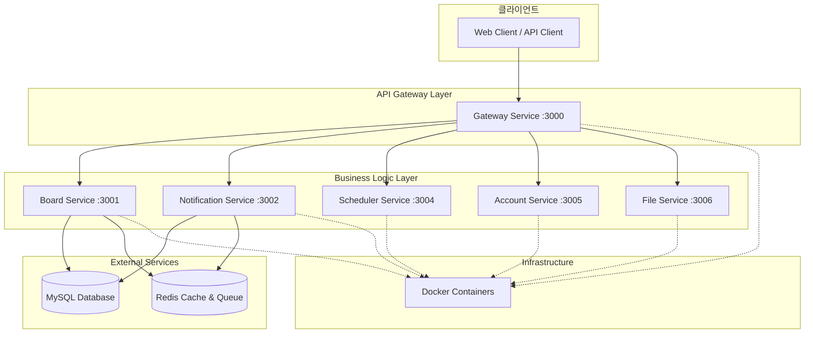
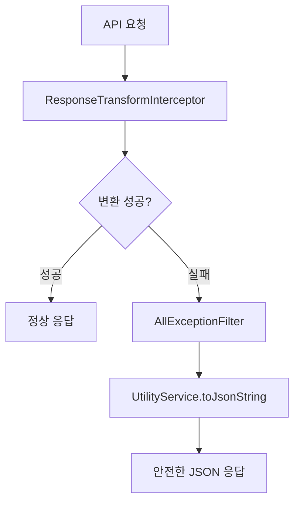

# System Architecture - NestJS 마이크로서비스 스켈레톤 프로젝트

## 🏗️ 시스템 개요

**프로젝트명**: NestJS 마이크로서비스 스켈레톤 프로젝트  
**프로젝트 성격**: 즉시 사용 가능한 완성도 높은 MSA 템플릿  
**아키텍처**: Microservice Architecture (MSA)  
**개발 프레임워크**: NestJS v11  
**런타임**: Node.js v22 (LTS)  
**언어**: TypeScript v5.1.3  
**컴파일러**: SWC (15.6% 성능 향상)  
**데이터베이스**: MySQL (TypeORM 사용)  
**캐싱**: Redis (Bull Queue)  
**통신 프로토콜**: HTTP (외부), TCP (내부)  
**패키지 매니저**: pnpm v8  
**컨테이너화**: Docker + Docker Compose

> **핵심 가치**: 기능만 추가하면 바로 프로덕션에 사용할 수 있는 완성도 높은 NestJS 마이크로서비스 스켈레톤

## 🎯 설계 원칙

### 1. 자동화 우선 (Automation First)

- **완전 자동화된 응답 검증/변환 시스템**: `@CheckResponseWithType` 데코레이터
- **제로 설정**: 하드코딩 없는 동적 타입 추출
- **자동 에러 처리**: 3단계 방어 시스템

### 2. 타입 안전성 (Type Safety)

- **모든 DTO에 `@Type` 데코레이터 적용**
- **런타임 타입 검증 및 변환**
- **TypeScript 메타데이터 활용**

### 3. 마이크로서비스 분리 (Service Separation)

- **단일 책임 원칙** 기반 서비스 분리
- **독립적 배포 및 확장** 가능
- **장애 격리** 및 복구 지원

### 4. 개발 및 운영 효율성

- **Docker 컨테이너화**: 일관된 개발/운영 환경
- **pnpm v8**: 빠른 패키지 관리
- **SWC 컴파일러**: 초고속 빌드

## 🏛️ 마이크로서비스 구조



## 🐳 컨테이너 아키텍처

### Docker Compose 구성

```yaml
# 현재 Docker 구성
services:
  gateway: # 컨테이너명: gateway
    ports: ['3000:3000']

  board: # 컨테이너명: board
    ports: ['3001:3001']

  notification: # 컨테이너명: notification
    ports: ['3002:3002']

  scheduler: # 컨테이너명: scheduler
    ports: ['3004:3004']
```

**주요 특징:**

- ✅ **간소화된 컨테이너명**: `gateway`, `board`, `notification`, `scheduler`
- ✅ **프로젝트명**: `toy-project`
- ✅ **포트 매핑**: 호스트와 컨테이너 동일 포트 사용
- ✅ **공통 환경변수**: `x-common-env` 앵커 패턴 활용
- ✅ **최적화**: MySQL/Redis 제거 (외부 서비스 사용)

## 📊 포트 및 통신 구조

| 서비스           | 포트 | 컨테이너명     | 통신 방식 | 주요 기능               |
| ---------------- | ---- | -------------- | --------- | ----------------------- |
| **Gateway**      | 3000 | `gateway`      | HTTP      | API Gateway, Swagger    |
| **Board**        | 3001 | `board`        | TCP       | 게시판 CRUD, 댓글 관리  |
| **Notification** | 3002 | `notification` | TCP       | 키워드 알림, Queue 처리 |
| **Scheduler**    | 3004 | `scheduler`    | TCP       | 스케줄링, Cron 작업     |
| **Account**      | 3005 | `account`      | TCP       | 계정 관리, 사용자 인증  |
| **File**         | 3006 | `file`         | TCP       | 파일 업로드/다운로드    |

**통신 플로우:**

```
Client (HTTP) → Gateway (HTTP:3000) → Microservices (TCP:3001,3002,3004,3005,3006)
```

## 🏗️ 마이크로서비스 상세 구조

### 1. Gateway Service (:3000)

**역할**: API Gateway 및 HTTP → TCP 프록시

**기술 구성**:

- **HTTP 서버**: Express 기반 NestJS
- **프로토콜 변환**: HTTP → TCP
- **API 문서화**: Swagger UI (`/api-docs`)
- **헬스체크**: 모든 서비스 상태 확인

**구성요소**:

```typescript
apps/gateway/src/
├── main.ts                    # 애플리케이션 진입점
├── gateway.module.ts          # 메인 모듈
├── gateway.controller.ts      # API 라우팅 및 헬스체크
├── board.controller.ts        # 게시판 API 프록시
└── health.controller.ts       # 시스템 헬스체크
```

**주요 기능**:

- HTTP → TCP 프로토콜 변환
- API 문서화 (Swagger)
- 요청 라우팅 및 응답 집계
- CORS 설정 및 보안 헤더
- 전역 예외 처리

### 2. Board Service (:3001)

**역할**: 게시판 및 댓글 비즈니스 로직 처리

**기술 구성**:

- **TCP 마이크로서비스**: NestJS 마이크로서비스
- **데이터베이스**: TypeORM + MySQL
- **캐시**: Redis (키워드 알림 트리거)
- **검증**: ValidationPipe 전역 적용

**구성요소**:

```typescript
apps/board/src/
├── main.ts                    # 마이크로서비스 진입점
├── board.module.ts            # 게시판 모듈
├── board.controller.ts        # TCP 컨트롤러
└── board.service.ts           # 비즈니스 로직
```

**주요 기능**:

- 게시글 CRUD operations
- 댓글 및 대댓글 관리 (계층형 구조)
- 비밀번호 검증 (bcrypt)
- 키워드 알림 트리거
- 페이징 및 검색 기능
- 자동 응답 변환 (`@CheckResponseWithType`)

### 3. Notification Service (:3002)

**역할**: 키워드 기반 알림 처리

**기술 구성**:

- **TCP 마이크로서비스**: NestJS 마이크로서비스
- **백그라운드 처리**: Redis Bull Queue
- **알림 엔진**: 키워드 매칭 알고리즘
- **데이터베이스**: TypeORM + MySQL

**구성요소**:

```typescript
apps/notification/src/
├── main.ts                    # 마이크로서비스 진입점
├── notification.module.ts     # 알림 모듈
├── notification.controller.ts # TCP 컨트롤러
├── notification.service.ts    # 알림 비즈니스 로직
└── notification.processor.ts  # 백그라운드 처리
```

**주요 기능**:

- 키워드 매칭 엔진
- 비동기 알림 처리 (Bull Queue)
- 알림 이력 관리
- 중복 알림 방지
- 실시간 키워드 감지

### 4. Scheduler Service (:3004)

**역할**: 스케줄링 및 백그라운드 작업 처리

**기술 구성**:

- **TCP 마이크로서비스**: NestJS 마이크로서비스
- **스케줄링**: @nestjs/schedule (Cron 기반)
- **백그라운드 작업**: 주기적 작업 실행
- **독립 배포**: 다른 서비스와 분리된 CI/CD

**구성요소**:

```typescript
apps/scheduler/src/
├── main.ts                    # 마이크로서비스 진입점
├── scheduler.module.ts        # 스케줄러 모듈
├── scheduler.controller.ts    # TCP 컨트롤러
└── scheduler.service.ts       # 스케줄링 로직
```

**주요 기능**:

- 매분/5분/시간/일 단위 Cron 작업
- 스케줄러 시작/중지 제어
- 스케줄러 상태 모니터링
- 데이터베이스 정리 작업
- 알림 배치 처리

### 5. Account Service (:3005)

**역할**: 계정 관리 및 사용자 인증 (기본 구조)

**기술 구성**:

- **TCP 마이크로서비스**: NestJS 마이크로서비스
- **데이터베이스**: TypeORM + MySQL (연결됨)
- **검증**: ValidationPipe 전역 적용
- **상태**: 기본 헬스체크 구현

**구성요소**:

```typescript
apps/account/src/
├── main.ts                    # 마이크로서비스 진입점 (포트 3005)
├── account.module.ts          # 계정 모듈 (Database, Redis, Interceptor 연결)
├── account.controller.ts      # TCP 컨트롤러 (헬스체크만)
└── account.service.ts         # 기본 서비스 (헬스체크 구현)
```

**현재 구현된 기능**:

- ✅ 마이크로서비스 기본 구조
- ✅ 헬스체크 (`AccountHealthCheck`)
- ✅ 데이터베이스 연결 (DatabaseService)
- ✅ Redis 연결 (RedisModule)
- ✅ 자동 응답 변환 인터셉터 (InterceptorModule)
- ✅ 전역 예외 처리 (AllExceptionFilter)
- ✅ 유틸리티 서비스 (UtilityModule)

**향후 확장 예정**:

- 사용자 등록 및 인증
- JWT 토큰 발급/검증
- 계정 정보 CRUD
- 권한 관리 (RBAC)

### 6. File Service (:3006)

**역할**: 파일 관리 서비스 (기본 구조)

**기술 구성**:

- **TCP 마이크로서비스**: NestJS 마이크로서비스
- **데이터베이스**: TypeORM + MySQL (연결됨)
- **검증**: ValidationPipe 전역 적용
- **상태**: 기본 헬스체크 구현

**구성요소**:

```typescript
apps/file/src/
├── main.ts                    # 마이크로서비스 진입점 (포트 3006)
├── file.module.ts             # 파일 모듈 (Database, Redis, Interceptor 연결)
├── file.controller.ts         # TCP 컨트롤러 (헬스체크만)
└── file.service.ts            # 기본 서비스 (헬스체크 구현)
```

**현재 구현된 기능**:

- ✅ 마이크로서비스 기본 구조
- ✅ 헬스체크 (`FileHealthCheck`)
- ✅ 데이터베이스 연결 (DatabaseService)
- ✅ Redis 연결 (RedisModule)
- ✅ 자동 응답 변환 인터셉터 (InterceptorModule)
- ✅ 전역 예외 처리 (AllExceptionFilter)
- ✅ 유틸리티 서비스 (UtilityModule)

**향후 확장 예정**:

- 파일 메타데이터 관리
- 파일 권한 제어
- 파일 업로드/다운로드 (아키텍처 결정 후)
- 파일 버전 관리

**🔥 아키텍처 검토 과제**:
파일 처리를 Gateway에서 직접 할지, File Service에서 할지 성능/비용 vs 관심사분리 관점에서 결정 필요

- Option A: Gateway 직접 처리 (성능 우선)
- Option B: File Service 처리 (관심사 분리)
- Option C: 하이브리드 (업계 표준)

## 📚 공유 라이브러리 구조

### 1. libs/common - 공통 기능

**구성요소**:

```typescript
libs/common/src/
├── constants/                 # 상수 정의
│   ├── constants.ts          # RedisQueueName, SOURCE_TYPE
│   └── index.ts
├── decorators/               # 커스텀 데코레이터
│   ├── check-response.decorator.ts  # @CheckResponseWithType
│   └── transform.decorator.ts       # @NumberTransform, @StringTransform
├── interceptors/             # 인터셉터
│   ├── interceptor.module.ts        # 인터셉터 모듈
│   └── response-transform.interceptor.ts  # 자동 응답 변환
└── index.ts
```

**핵심 기능**:

- **자동화된 응답 검증/변환 시스템**
- **타입 안전성 보장**
- **성능 최적화된 인터셉터**

### 2. libs/core - 핵심 인프라

**구성요소**:

```typescript
libs/core/src/
├── config/                   # 설정 관리
│   ├── config.module.ts     # 설정 모듈
│   └── config.service.ts    # 환경별 설정
├── filter/exception/         # 예외 필터
│   └── all-exception.filter.ts  # 글로벌 예외 처리
├── redis/                    # Redis 모듈
│   └── redis.module.ts
└── index.ts
```

**핵심 기능**:

- **환경별 설정 관리** (dev/qa/prod)
- **3단계 예외 방어 시스템**
- **Redis 연결 및 Queue 관리**

### 3. libs/database - 데이터 계층

**도메인별 분리 구조**:

```typescript
libs/database/src/
├── board/                    # 게시판 도메인
│   ├── entities/            # 엔티티
│   │   ├── board.entity.ts
│   │   └── comment.entity.ts
│   └── repositories/        # 리포지토리
│       ├── board.repository.ts
│       └── comment.repository.ts
├── common/                   # 공통 도메인
│   ├── entities/
│   │   ├── keyword-notification.entity.ts
│   │   └── test.entity.ts
│   └── repositories/
│       ├── keyword-notification.repository.ts
│       └── test.repository.ts
├── database.module.ts        # 데이터베이스 모듈
└── database.service.ts       # 데이터베이스 서비스
```

### 4. libs/global-dto - API 계약

**도메인별 DTO 구조**:

```typescript
libs/global-dto/src/
└── board/
    ├── request/              # 요청 DTO
    │   ├── board-manage-request.ts
    │   └── board-comment-manage.request.ts
    └── response/             # 응답 DTO
        ├── board-manage-response.ts
        └── board-comment-manage-response.ts
```

### 5. libs/utility - 유틸리티

**글로벌 유틸리티**:

```typescript
libs/utility/src/
├── services/
│   └── utility.service.ts    # 공통 유틸리티 함수
└── utility.module.ts         # 글로벌 유틸리티 모듈
```

**주요 기능**:

- **안전한 JSON 직렬화** (`toJsonString`)
- **에러 처리 유틸리티**
- **공통 헬퍼 함수**

### 6. libs/proxy - 서비스 통신

**마이크로서비스 통신**:

```typescript
libs/proxy/src/
└── common-proxy-client.ts    # MSA 통신 클라이언트
```

## 🔧 자동화된 응답 검증/변환 시스템

### 핵심 특징

이 프로젝트의 가장 큰 특징은 **완전히 자동화된 응답 검증 및 변환 시스템**입니다.

#### 1. `@CheckResponseWithType` 데코레이터

```typescript
// 컨트롤러에서 응답 타입 명시
@MessagePattern(CustomMessagePatterns.CreateBoard)
@CheckResponseWithType(CreateBoardResponse) // 👈 응답 타입 지정
async createBoard(@Payload() input: CreateBoardRequest): Promise<CreateBoardResponse> {
  return this.boardService.createBoard(input);
}
```

#### 2. 자동 타입 추출 및 변환

```typescript
// ResponseTransformInterceptor가 자동으로 처리
export class ResponseTransformInterceptor implements NestInterceptor {
  async intercept(context: ExecutionContext, next: CallHandler) {
    const result = await next.handle().toPromise();

    // @CheckResponseWithType에서 지정한 타입 자동 추출
    const responseClass = this.reflector.get(
      'response-type',
      context.getHandler(),
    );

    if (responseClass) {
      // class-transformer로 자동 변환
      return plainToClass(responseClass, result, {
        excludeExtraneousValues: true, // @Expose() 필드만 포함
        enableImplicitConversion: true,
      });
    }

    return result;
  }
}
```

#### 3. 3단계 에러 방어 시스템



1. **ResponseTransformInterceptor**: 자동 타입 변환 및 검증
2. **AllExceptionFilter**: 모든 예외의 최종 처리
3. **UtilityService**: 안전한 JSON 직렬화

## 🐳 Docker 구성

### Docker Compose 최적화

**현재 구성 특징**:

```yaml
# docker-compose.yml
name: toy-project

services:
  gateway:
    container_name: gateway
    ports: ['3000:3000']

  board:
    container_name: board
    ports: ['3001:3001']

  notification:
    container_name: notification
    ports: ['3002:3002']

  scheduler:
    container_name: scheduler
    ports: ['3004:3004']
```

**최적화 포인트**:

- ✅ **간소화된 이름**: 불필요한 접두사 제거
- ✅ **네트워크 최적화**: 커스텀 네트워크 제거 (기본 네트워크 사용)
- ✅ **외부 서비스 분리**: MySQL/Redis를 외부 서비스로 분리
- ✅ **환경변수 통합**: `x-common-env` 앵커 패턴

### Dockerfile 최적화

**멀티스테이지 빌드**:

```dockerfile
# 1단계: 의존성 설치 (pnpm 8버전 고정)
FROM node:22-alpine AS deps
RUN corepack enable && corepack prepare pnpm@8.15.6 --activate
RUN pnpm install --frozen-lockfile

# 2단계: 애플리케이션 빌드 (SWC 사용)
FROM node:22-alpine AS builder
RUN pnpm run build ${TARGET_APPS} --builder swc

# 3단계: 프로덕션 실행
FROM node:22-alpine AS app
COPY --from=builder /app/dist ./dist
CMD ["node", "dist/apps/${APP_NAME}/main.js"]
```

**성능 최적화**:

- ✅ **pnpm 8.15.6 고정**: 일관된 의존성 관리
- ✅ **SWC 컴파일러**: 15.6% 빌드 성능 향상
- ✅ **캐시 최적화**: Docker 레이어 캐싱 활용
- ✅ **경량화**: Alpine Linux 기반

## 🚀 개발 환경

### 스크립트 자동화

**package.json 스크립트**:

```json
{
  "scripts": {
    // SWC 기반 개발 서버 (자동 적용)
    "start:dev:gateway": "NODE_ENV=dev nest start gateway --watch --debug --builder swc",
    "start:dev:board": "NODE_ENV=dev nest start board --watch --debug --builder swc",

    // SWC 기반 빌드
    "build:all:swc": "nest build gateway --builder swc && nest build board --builder swc",

    // Docker 명령어
    "docker:dev": "./docker.sh dev",
    "docker:qa": "./docker.sh qa --profile full",
    "docker:prod": "./docker.sh prod"
  }
}
```

### 환경별 설정

**환경 파일 구조**:

```
env/
├── dev.env     # 개발 환경 (기본값)
├── qa.env      # QA 환경
└── prod.env    # 프로덕션 환경
```

**환경별 포트 구성**:

```bash
# env/dev.env
GATEWAY_SERVICE_PORT=3000
BOARD_SERVICE_PORT=3001
NOTIFICATION_SERVICE_PORT=3002
TEST2_SERVICE_PORT=3003

# 데이터베이스 (외부 서비스)
DB_HOST=localhost
DB_PORT=3306
REDIS_HOST=localhost
REDIS_PORT=6379
```

## 📈 성능 최적화

### SWC 컴파일러 최적화

- **빌드 성능**: Webpack 컴파일 15.6% 향상 (1710ms vs 2027ms)
- **개발 서버**: 483ms 초고속 빌드
- **자동 적용**: 모든 개발 스크립트에서 SWC 자동 사용

### pnpm 최적화

- **디스크 공간 절약**: 심볼릭 링크를 통한 중복 제거
- **빠른 설치**: npm/yarn 대비 2-3배 빠른 속도
- **효율적인 캐시**: 글로벌 저장소 활용

### Docker 최적화

- **멀티스테이지 빌드**: 최종 이미지 크기 최소화
- **레이어 캐싱**: 의존성 변경 없을 때 캐시 활용
- **Alpine Linux**: 경량 베이스 이미지

### 데이터베이스 최적화

- **인덱스 최적화**: 검색 성능 향상
- **페이징**: 대용량 데이터 효율적 처리
- **연관 관계**: N+1 문제 방지

### 비동기 처리

- **Redis Queue**: 알림 처리 비동기화
- **Background Jobs**: 시스템 응답성 향상

## 🔒 보안 구현 현황

### 입력 데이터 검증

- **class-validator**: 자동 유효성 검증
- **SQL Injection 방지**: TypeORM 사용
- **XSS 방지**: 입력 데이터 이스케이프

### 비밀번호 보안

- **bcrypt 해시**: 단방향 암호화 (salt 자동 생성)
- **평문 저장 금지**: 해시된 값만 저장
- **응답 제외**: `@Expose()` 없는 필드 자동 제외

### 에러 정보 보안

- **프로덕션 모드**: 상세 에러 스택 숨김
- **민감 정보 제외**: 로그에서 민감 정보 차단

## 📊 모니터링 및 로깅

### 헬스체크 엔드포인트

- Gateway: `GET /health-check`
- Board: `GET /board/health-check`
- Notification: `GET /notification/health-check`

### Docker 로깅

```bash
# 간단한 로그 확인
docker logs gateway
docker logs board

# docker-compose 로그
docker-compose logs gateway
docker-compose logs -f board  # 실시간
```

### 로깅 시스템

- **성공 로그**: 응답 검증 성공 시 자동 로깅
- **에러 로그**: 검증 실패 시 상세 에러 정보 출력
- **안전한 JSON 직렬화**: UtilityService 활용

## 🎯 현재 운영 상태

### 완료된 시스템 구성

- **✅ 4개 마이크로서비스**: Gateway, Board, Notification, Scheduler 운영 중
- **✅ 자동화된 응답 시스템**: 완전 자동화된 타입 검증/변환
- **✅ Docker 컨테이너화**: 일관된 개발/운영 환경
- **✅ 고성능 빌드**: SWC 컴파일러로 15.6% 성능 향상
- **✅ 효율적 패키지 관리**: pnpm v8 적용

### 운영 중인 핵심 기능

- **게시판 시스템**: CRUD + 댓글 관리
- **알림 처리**: Redis Queue 기반 비동기 처리
- **스케줄링**: Cron 기반 배치 작업
- **계정 관리**: 사용자 인증 및 계정 관리
- **파일 관리**: 파일 업로드/다운로드 시스템
- **보안**: bcrypt 암호화 + 자동 검증

## 🚀 향후 개선 과제

### 1. 파일 처리 아키텍처 최적화 🔥

**현재 상황**: File App에서 파일 처리 (TCP 통신 경유)  
**검토 과제**: Gateway 직접 처리 vs File Service 처리

**옵션 분석**:

- **Option A**: Gateway 직접 처리 (성능 우선) - 네트워크 비용 절약, 응답속도 향상
- **Option B**: File Service 처리 (관심사 분리) - 마이크로서비스 원칙 준수
- **Option C**: 하이브리드 (업계 표준) - Gateway는 업로드/다운로드, Service는 메타데이터

**결정 기준**: 파일 크기, 처리량 요구사항, 비용 효율성, 운영 복잡도

### 2. 기술 부채 및 개선사항

**서비스 확장성**: 현재 기본 헬스체크만 → 실제 비즈니스 로직 구현  
**모니터링 강화**: 기본 로깅 → 프로덕션 레디 모니터링 (Prometheus, Jaeger)  
**테스트 커버리지**: 기본 구조 → 90% 이상 커버리지 달성

## 🔧 새로운 서비스 추가 아키텍처 패턴

### 서비스 구조 템플릿

```typescript
// 새 서비스 구조 예시
apps/{servicename}/src/
├── main.ts                    # 마이크로서비스 진입점
├── {servicename}.module.ts    # 서비스 메인 모듈
├── {servicename}.controller.ts # TCP 컨트롤러
├── {servicename}.service.ts   # 비즈니스 로직
└── dto/                       # 요청/응답 DTO
    ├── create-{resource}.dto.ts
    └── update-{resource}.dto.ts
```

### 아키텍처 다이어그램 업데이트 패턴

새 서비스 추가 시 Mermaid 다이어그램에 추가:

```mermaid
subgraph "Business Logic Layer"
    Board[Board Service :3001]
    Notification[Notification Service :3002]
    Scheduler[Scheduler Service :3004]
    NewService[New Service :3005]  # 새 서비스 추가
end

Gateway --> NewService  # 연결 추가
```

### 서비스 간 통신 패턴

**표준 통신 방식**:

- **Gateway → Service**: TCP 메시지 패턴
- **Service → Service**: 이벤트 기반 (Redis Queue)
- **Service → Database**: TypeORM Repository 패턴

### 공통 라이브러리 활용

**모든 새 서비스는 다음 공통 라이브러리 사용**:

- `libs/common` - 공통 데코레이터 및 인터셉터
- `libs/core` - 설정 및 예외 처리
- `libs/database` - Entity 및 Repository
- `libs/global-dto` - 공통 DTO

---

**Made with ❤️ using NestJS v11, Node.js v22, Docker, and pnpm v8**
