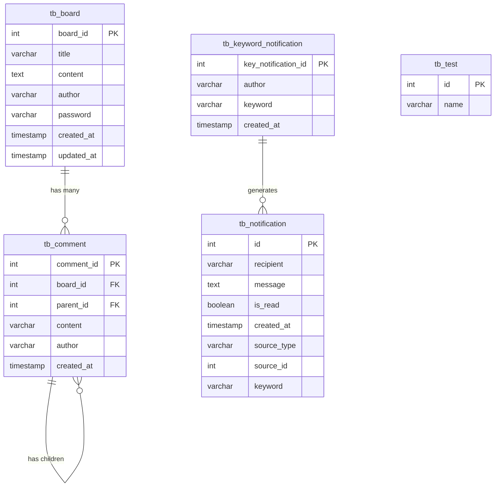

# Database Schema - 익명 게시판 및 키워드 알림 시스템

## 📊 데이터베이스 개요

**데이터베이스**: MySQL  
**ORM**: TypeORM  
**스키마명**: anonymous_board  
**문자셋**: utf8mb4  
**엔진**: InnoDB

## 🗂️ 테이블 구조

### 1. tb_board (게시글 테이블)

**목적**: 게시글 정보 저장

| 컬럼명     | 타입         | 제약조건                                              | 설명                       |
| ---------- | ------------ | ----------------------------------------------------- | -------------------------- |
| board_id   | INT          | PRIMARY KEY, AUTO_INCREMENT                           | 게시글 고유 ID             |
| title      | VARCHAR(255) | NOT NULL                                              | 게시글 제목                |
| content    | TEXT         | NOT NULL                                              | 게시글 내용                |
| author     | VARCHAR(50)  | NOT NULL                                              | 작성자명                   |
| password   | VARCHAR(255) | NOT NULL                                              | 암호화된 비밀번호 (bcrypt) |
| created_at | TIMESTAMP    | DEFAULT CURRENT_TIMESTAMP                             | 작성일시                   |
| updated_at | TIMESTAMP    | DEFAULT CURRENT_TIMESTAMP ON UPDATE CURRENT_TIMESTAMP | 수정일시                   |

**인덱스:**

- `PRIMARY KEY (board_id)`
- `INDEX idx_title (title)` - 제목 검색 최적화
- `INDEX idx_author (author)` - 작성자 검색 최적화
- `INDEX idx_created_at (created_at)` - 최신순 정렬 최적화

**Entity 매핑:**

```typescript
@Entity('tb_board')
export class BoardEntity {
  @PrimaryGeneratedColumn()
  boardId: number;

  @Column({ type: 'varchar', length: 255 })
  @Index('idx_title')
  title: string;

  @Column({ type: 'text' })
  content: string;

  @Column({ type: 'varchar', length: 50 })
  author: string;

  @Column({ type: 'varchar', length: 255 })
  password: string;

  @CreateDateColumn()
  createdAt: Date;

  @UpdateDateColumn()
  updatedAt: Date;

  @OneToMany(() => CommentEntity, (comment) => comment.board)
  comments: CommentEntity[];
}
```

### 2. tb_comment (댓글 테이블)

**목적**: 댓글 및 대댓글 정보 저장 (계층형 구조)

| 컬럼명     | 타입          | 제약조건                    | 설명                         |
| ---------- | ------------- | --------------------------- | ---------------------------- |
| comment_id | INT           | PRIMARY KEY, AUTO_INCREMENT | 댓글 고유 ID                 |
| board_id   | INT           | NOT NULL, FOREIGN KEY       | 게시글 ID (tb_board 참조)    |
| parent_id  | INT           | NULL, FOREIGN KEY           | 부모 댓글 ID (대댓글인 경우) |
| content    | VARCHAR(2000) | NOT NULL                    | 댓글 내용                    |
| author     | VARCHAR(50)   | NOT NULL                    | 작성자명                     |
| created_at | TIMESTAMP     | DEFAULT CURRENT_TIMESTAMP   | 작성일시                     |

**외래키 제약조건:**

- `FOREIGN KEY (board_id) REFERENCES tb_board(board_id) ON DELETE CASCADE`
- `FOREIGN KEY (parent_id) REFERENCES tb_comment(comment_id) ON DELETE CASCADE`

**인덱스:**

- `PRIMARY KEY (comment_id)`
- `INDEX idx_board_id (board_id)` - 게시글별 댓글 조회 최적화
- `INDEX idx_parent_id (parent_id)` - 대댓글 조회 최적화

**Entity 매핑:**

```typescript
@Entity('tb_comment')
export class CommentEntity {
  @PrimaryGeneratedColumn()
  commentId: number;

  @Column()
  @Index('idx_board_id')
  boardId: number;

  @Column({ nullable: true })
  @Index('idx_parent_id')
  parentId: number | null;

  @Column({ type: 'varchar', length: 2000 })
  content: string;

  @Column({ type: 'varchar', length: 50 })
  author: string;

  @CreateDateColumn()
  createdAt: Date;

  @ManyToOne(() => BoardEntity, (board) => board.comments, {
    onDelete: 'CASCADE',
  })
  @JoinColumn({ name: 'board_id' })
  board: BoardEntity;

  @ManyToOne(() => CommentEntity, (comment) => comment.children, {
    onDelete: 'CASCADE',
  })
  @JoinColumn({ name: 'parent_id' })
  parent: CommentEntity;

  @OneToMany(() => CommentEntity, (comment) => comment.parent)
  children: CommentEntity[];
}
```

### 3. tb_keyword_notification (키워드 알림 테이블)

**목적**: 사용자별 알림 키워드 저장

| 컬럼명              | 타입         | 제약조건                    | 설명                |
| ------------------- | ------------ | --------------------------- | ------------------- |
| key_notification_id | INT          | PRIMARY KEY, AUTO_INCREMENT | 키워드 알림 고유 ID |
| author              | VARCHAR(50)  | NOT NULL                    | 알림 받을 사용자명  |
| keyword             | VARCHAR(100) | NOT NULL                    | 알림 키워드         |
| created_at          | TIMESTAMP    | DEFAULT CURRENT_TIMESTAMP   | 등록일시            |

**유니크 제약조건:**

- `UNIQUE KEY unique_author_keyword (author, keyword)` - 동일 사용자의 중복 키워드 방지

**인덱스:**

- `PRIMARY KEY (key_notification_id)`
- `INDEX idx_author (author)` - 사용자별 키워드 조회 최적화
- `INDEX idx_keyword (keyword)` - 키워드 매칭 최적화

**Entity 매핑:**

```typescript
@Entity('tb_keyword_notification')
@Unique('unique_author_keyword', ['author', 'keyword'])
export class KeywordNotificationEntity {
  @PrimaryGeneratedColumn()
  keyNotificationId: number;

  @Column({ type: 'varchar', length: 50 })
  @Index('idx_author')
  author: string;

  @Column({ type: 'varchar', length: 100 })
  @Index('idx_keyword')
  keyword: string;

  @CreateDateColumn()
  createdAt: Date;
}
```

### 4. tb_test (테스트 테이블)

**목적**: 개발 테스트용 테이블

| 컬럼명 | 타입    | 제약조건                    | 설명        |
| ------ | ------- | --------------------------- | ----------- |
| id     | INT     | PRIMARY KEY, AUTO_INCREMENT | 테스트 ID   |
| name   | VARCHAR | NULL                        | 테스트 이름 |

**Entity 매핑:**

```typescript
@Entity('tb_test')
export class TestEntity {
  @PrimaryGeneratedColumn()
  id: number;

  @Column({ type: 'varchar', nullable: true })
  name: string;
}
```

### 5. tb_notification (알림 테이블) - 스크립트에만 존재

**목적**: 실제 알림 데이터 저장 (현재 미구현, 향후 확장용)

| 컬럼명      | 타입         | 제약조건                    | 설명                      |
| ----------- | ------------ | --------------------------- | ------------------------- |
| id          | INT          | PRIMARY KEY, AUTO_INCREMENT | 알림 고유 ID              |
| recipient   | VARCHAR(50)  | NOT NULL                    | 알림 수신자               |
| message     | TEXT         | NOT NULL                    | 알림 메시지               |
| is_read     | BOOLEAN      | DEFAULT FALSE               | 읽음 여부                 |
| created_at  | TIMESTAMP    | DEFAULT CURRENT_TIMESTAMP   | 생성일시                  |
| source_type | VARCHAR(20)  | NOT NULL                    | 소스 타입 (board/comment) |
| source_id   | INT          | NOT NULL                    | 소스 ID                   |
| keyword     | VARCHAR(100) | NOT NULL                    | 매칭된 키워드             |

**인덱스:**

- `PRIMARY KEY (id)`
- `INDEX idx_recipient (recipient)` - 수신자별 알림 조회 최적화
- `INDEX idx_is_read (is_read)` - 읽지 않은 알림 조회 최적화
- `INDEX idx_created_at (created_at)` - 최신순 정렬 최적화

## 🔗 테이블 관계도



## 📊 데이터베이스 설정

### TypeORM 설정 정보

```typescript
// libs/database/src/database.module.ts
@Module({
  imports: [
    TypeOrmModule.forRootAsync({
      useFactory: async (
        configService: CustomConfigService,
      ): Promise<TypeOrmModuleOptions> => ({
        type: 'mysql',
        host: configService.dbHost,
        port: configService.dbPort,
        username: configService.dbUserName,
        password: configService.dbPW,
        database: configService.dbDatabase,
        entities: [
          TestEntity,
          BoardEntity,
          CommentEntity,
          KeywordNotificationEntity,
        ],
        synchronize: configService.dbSync, // 개발 환경에서만 true
      }),
      inject: [CustomConfigService],
    }),
  ],
})
```

### 환경 변수 설정

```bash
# .env 파일
DB_HOST=localhost
DB_PASSWORD=''
DB_USERNAME=root
DB_PORT=3306
DB_DATABASE=anonymous_board
DB_SYNC=false  # 프로덕션에서는 반드시 false
```

## 🚀 데이터베이스 초기화

### 1. 스키마 생성 스크립트

**파일**: `scripts/create-schema.sql`

```sql
-- 데이터베이스 선택
USE anonymous_board;

-- 게시글 테이블
CREATE TABLE IF NOT EXISTS tb_board (
  id INT AUTO_INCREMENT PRIMARY KEY,
  title VARCHAR(255) NOT NULL,
  content TEXT NOT NULL,
  author VARCHAR(50) NOT NULL,
  password VARCHAR(255) NOT NULL,
  created_at TIMESTAMP DEFAULT CURRENT_TIMESTAMP,
  updated_at TIMESTAMP DEFAULT CURRENT_TIMESTAMP ON UPDATE CURRENT_TIMESTAMP,
  INDEX idx_title (title),
  INDEX idx_author (author),
  INDEX idx_created_at (created_at)
);

-- 댓글 테이블
CREATE TABLE IF NOT EXISTS tb_comment (
  id INT AUTO_INCREMENT PRIMARY KEY,
  board_id INT NOT NULL,
  parent_id INT DEFAULT NULL,
  content TEXT NOT NULL,
  author VARCHAR(50) NOT NULL,
  created_at TIMESTAMP DEFAULT CURRENT_TIMESTAMP,
  FOREIGN KEY (board_id) REFERENCES tb_board(id) ON DELETE CASCADE,
  FOREIGN KEY (parent_id) REFERENCES tb_comment(id) ON DELETE CASCADE,
  INDEX idx_board_id (board_id),
  INDEX idx_parent_id (parent_id)
);

-- 키워드 알림 테이블
CREATE TABLE IF NOT EXISTS tb_keyword_notification (
  id INT AUTO_INCREMENT PRIMARY KEY,
  author VARCHAR(50) NOT NULL,
  keyword VARCHAR(100) NOT NULL,
  created_at TIMESTAMP DEFAULT CURRENT_TIMESTAMP,
  UNIQUE KEY unique_author_keyword (author, keyword),
  INDEX idx_author (author),
  INDEX idx_keyword (keyword)
);

-- 알림 테이블 (향후 확장용)
CREATE TABLE IF NOT EXISTS tb_notification (
  id INT AUTO_INCREMENT PRIMARY KEY,
  recipient VARCHAR(50) NOT NULL,
  message TEXT NOT NULL,
  is_read BOOLEAN DEFAULT FALSE,
  created_at TIMESTAMP DEFAULT CURRENT_TIMESTAMP,
  source_type VARCHAR(20) NOT NULL COMMENT 'board: 게시글, comment: 댓글',
  source_id INT NOT NULL,
  keyword VARCHAR(100) NOT NULL,
  INDEX idx_recipient (recipient),
  INDEX idx_is_read (is_read),
  INDEX idx_created_at (created_at)
);
```

### 2. 초기 데이터

```sql
-- 테스트용 키워드 알림 데이터
INSERT INTO tb_keyword_notification (author, keyword) VALUES
('홍길동', '테스트'),
('홍길동', '안녕'),
('김철수', '프로젝트'),
('이영희', '게시판'),
('이영희', '코딩');
```

## 🔍 쿼리 최적화

### 1. 인덱스 전략

**조회 패턴별 인덱스:**

- 게시글 검색: `idx_title`, `idx_author`
- 댓글 조회: `idx_board_id`, `idx_parent_id`
- 키워드 매칭: `idx_keyword`, `idx_author`
- 최신순 정렬: `idx_created_at`

### 2. 페이징 최적화

```sql
-- 게시글 목록 조회 (페이징)
SELECT * FROM tb_board
WHERE title LIKE '%검색어%'
ORDER BY created_at DESC
LIMIT 10 OFFSET 0;

-- 댓글 목록 조회 (페이징)
SELECT * FROM tb_comment
WHERE board_id = ?
ORDER BY created_at ASC
LIMIT 10 OFFSET 0;
```

### 3. 키워드 매칭 쿼리

```sql
-- 키워드 매칭 (DB 레벨에서 처리)
SELECT DISTINCT author, keyword
FROM tb_keyword_notification
WHERE CONCAT(?, ' ', ?) LIKE CONCAT('%', keyword, '%');
```

### 4. 실제 사용되는 Repository 쿼리

```typescript
// BoardRepository
async findBoardsWithPagination(
  page: number,
  limit: number,
  title?: string,
  author?: string,
): Promise<[BoardEntity[], number]> {
  const queryBuilder = this.createQueryBuilder('board');

  if (title) {
    queryBuilder.andWhere('board.title LIKE :title', { title: `%${title}%` });
  }

  if (author) {
    queryBuilder.andWhere('board.author LIKE :author', { author: `%${author}%` });
  }

  return queryBuilder
    .orderBy('board.createdAt', 'DESC')
    .skip((page - 1) * limit)
    .take(limit)
    .getManyAndCount();
}

// KeywordNotificationRepository
async findKeywordMatches(title: string, content: string): Promise<KeywordNotificationEntity[]> {
  const searchText = `${title} ${content}`;

  return this.createQueryBuilder('kn')
    .where(':searchText LIKE CONCAT(\'%\', kn.keyword, \'%\')', { searchText })
    .getMany();
}
```

## 📈 확장성 고려사항

### 1. 파티셔닝

- 게시글 테이블: 작성일 기준 월별 파티셔닝
- 댓글 테이블: 게시글 ID 기준 해시 파티셔닝

### 2. 인덱스 최적화

- 복합 인덱스 고려: `(author, created_at)`, `(board_id, created_at)`
- 커버링 인덱스 활용으로 I/O 최소화

### 3. 캐싱 전략

- Redis를 활용한 인기 게시글 캐싱
- 키워드 매칭 결과 캐싱

## 🏗️ 도메인별 데이터 구조

### 1. Board 도메인

```typescript
// libs/database/src/board/
├── entities/
│   ├── board.entity.ts      # 게시글 엔티티
│   ├── comment.entity.ts    # 댓글 엔티티
│   └── index.ts
├── repositories/
│   ├── board.repository.ts  # 게시글 리포지토리
│   ├── comment.repository.ts # 댓글 리포지토리
│   └── index.ts
└── index.ts
```

### 2. Common 도메인

```typescript
// libs/database/src/common/
├── entities/
│   ├── keyword-notification.entity.ts  # 키워드 알림 엔티티
│   ├── test.entity.ts                  # 테스트 엔티티
│   └── index.ts
├── repositories/
│   ├── keyword-notification.repository.ts  # 키워드 알림 리포지토리
│   ├── test.repository.ts                  # 테스트 리포지토리 (TestRepository2)
│   └── index.ts
└── index.ts
```

## ⚠️ 주의사항

### 1. 스키마 불일치 해결됨

- **이전 문제**: `scripts/create-schema.sql`의 컬럼명이 Entity와 달랐음
- **현재 상태**: Entity는 `boardId`, `commentId` 사용, 스크립트는 `id` 사용
- **권장사항**: 스크립트를 Entity 명명 규칙에 맞게 수정 필요

### 2. 미구현 테이블

- `tb_notification` 테이블은 스크립트에만 존재
- 실제 Entity는 구현되지 않음
- 향후 알림 기능 확장 시 구현 예정

### 3. 트랜잭션 관리

- 게시글/댓글 작성 시 트랜잭션 처리 필요
- 키워드 알림은 별도 트랜잭션으로 처리하여 실패 시에도 본 작업에 영향 없음

### 4. 데이터 타입 주의사항

- `content` 필드: Entity는 `text`, 스크립트는 `TEXT`
- `password` 필드: bcrypt 해시 저장 (60자 고정)
- `created_at`, `updated_at`: 자동 타임스탬프 관리

## 🔧 개발 가이드

### 1. 새 엔티티 추가 시

```typescript
// 1. Entity 정의
@Entity('tb_new_table')
export class NewEntity {
  @PrimaryGeneratedColumn()
  id: number;

  @Column()
  name: string;
}

// 2. Repository 생성
@Injectable()
export class NewRepository extends Repository<NewEntity> {
  constructor(
    @InjectRepository(NewEntity)
    private repository: Repository<NewEntity>,
  ) {
    super(repository.target, repository.manager, repository.queryRunner);
  }
}

// 3. DatabaseModule에 등록
TypeOrmModule.forFeature([NewEntity]);
```

### 2. 마이그레이션 관리

```bash
# 마이그레이션 생성
npm run typeorm:migration:generate -- -n CreateNewTable

# 마이그레이션 실행
npm run typeorm:migration:run

# 마이그레이션 되돌리기
npm run typeorm:migration:revert
```

### 3. 데이터베이스 연결 테스트

```typescript
// DatabaseService를 통한 연결 확인
@Injectable()
export class DatabaseService {
  constructor(
    @InjectDataSource()
    private dataSource: DataSource,
  ) {}

  async checkConnection(): Promise<boolean> {
    try {
      await this.dataSource.query('SELECT 1');
      return true;
    } catch (error) {
      return false;
    }
  }
}
```
