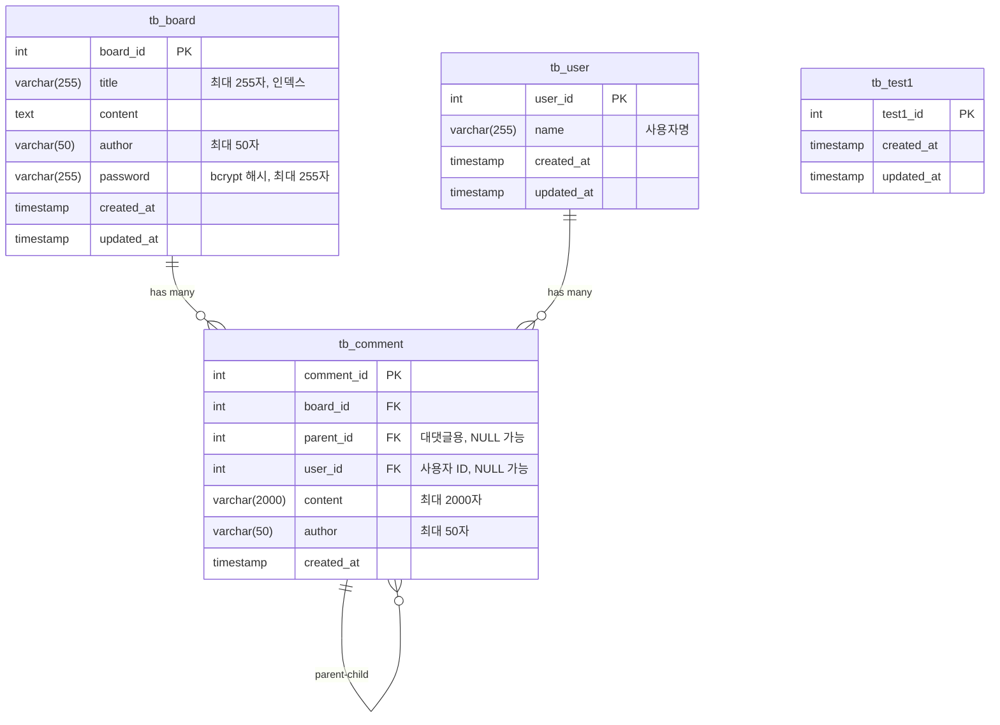

# Database Schema - 데이터베이스 설계

## 🗄️ 데이터베이스 개요

**DBMS**: MySQL 8.0+  
**ORM**: TypeORM  
**연결 방식**: 외부 서비스 (Docker 컨테이너 외부)  
**스키마 설계**: 도메인별 분리 구조  
**네이밍 규칙**: snake_case (테이블), camelCase (Entity)

## 🏗️ 도메인별 구조

### 📁 libs/database 구조

```
libs/database/src/
├── entities/                 # 모든 Entity 통합 관리
│   ├── tb-board.entity.ts
│   ├── tb-comment.entity.ts
│   ├── tb-user.entity.ts
│   ├── tb-test1.entity.ts
│   ├── tb-test2.entity.ts
│   ├── tb-test3.entity.ts
│   ├── tb-deleted-test.entity.ts      # @deprecated
│   ├── tb-keyword-notification.entity.ts  # @deprecated
│   ├── tb-notification.entity.ts     # @deprecated
│   └── index.ts              # ALL_ENTITIES 배열
├── repositories/             # Repository 통합 관리
│   ├── board.repository.ts
│   ├── comment.repository.ts
│   ├── tb-user.repository.ts
│   ├── tb-test1.repository.ts
│   ├── tb-test2.repository.ts
│   ├── tb-test3.repository.ts
│   └── index.ts              # ALL_REPOSITORIES 배열
├── procedures/               # 저장 프로시저 SQL 파일들
│   ├── procedures/
│   └── functions/
├── services/
│   └── enhanced-board.service.ts
├── database.module.ts        # 데이터베이스 모듈
├── database.service.ts       # 데이터베이스 서비스
├── ENHANCED_RAW_SQL_GUIDE.md # Raw SQL 가이드
└── index.ts                  # 통합 export
```

## 📊 테이블 구조 개요

### 🟢 활성 테이블 (현재 운영 중)

| 테이블       | Entity            | 주요 기능            | 관계                                    | 상태    |
| ------------ | ----------------- | -------------------- | --------------------------------------- | ------- |
| `tb_board`   | `TbBoardEntity`   | 게시글 CRUD          | 1:N → tb_comment                        | ✅ 활성 |
| `tb_comment` | `TbCommentEntity` | 댓글/대댓글 (계층형) | N:1 → tb_board, tb_user, Self-Reference | ✅ 활성 |
| `tb_user`    | `TbUserEntity`    | 사용자 정보          | 1:N → tb_comment                        | ✅ 활성 |
| `tb_test1`   | `TbTest1Entity`   | 테스트용 테이블      | 독립 테이블                             | ✅ 활성 |

### 🔴 Deprecated 테이블 (호환성 유지)

| 테이블                    | Entity                        | 상태                 | 삭제일     |
| ------------------------- | ----------------------------- | -------------------- | ---------- |
| `tb_keyword_notification` | `TbKeywordNotificationEntity` | @deprecated (삭제됨) | 2025-09-13 |
| `tb_notification`         | `TbNotificationEntity`        | @deprecated (삭제됨) | 2025-09-13 |
| `tb_deleted_test`         | `TbDeletedTestEntity`         | @deprecated (삭제됨) | 2025-09-13 |

### 🔧 기타 테이블

| 테이블     | Entity          | 상태     | 용도          |
| ---------- | --------------- | -------- | ------------- |
| `tb_test2` | `TbTest2Entity` | 비활성화 | 개발/테스트용 |
| `tb_test3` | `TbTest3Entity` | 비활성화 | 개발/테스트용 |

## 🔗 Entity 관계도 (활성 테이블)



### 🔴 Deprecated Entity 구조 (참고용)

```sql
-- ⚠️ 이 테이블들은 @deprecated 상태입니다
-- tb_keyword_notification (삭제됨: 2025-09-13)
-- tb_notification (삭제됨: 2025-09-13)
-- tb_deleted_test (삭제됨: 2025-09-13)
```

## 🎯 주요 설계 원칙

### 1. 통합 관리 구조

- **Entity 통합**: 모든 Entity를 단일 폴더에서 관리
- **Repository 통합**: 모든 Repository를 단일 폴더에서 관리
- **자동화**: Entity와 Repository 배열을 자동으로 생성 및 관리
- **Deprecated 관리**: 삭제된 테이블도 호환성을 위해 유지

### 2. 계층형 댓글 구조

- **Self-Reference**: comment 테이블의 parent_id
- **무한 깊이**: 대댓글의 대댓글 지원
- **Cascade 삭제**: 게시글 삭제 시 댓글 자동 삭제
- **사용자 연결**: user_id를 통한 사용자-댓글 관계

### 3. 보안 설계

- **비밀번호 해시**: bcrypt 사용, salt 자동 생성
- **인덱스 최적화**: 검색 성능 향상
- **제약 조건**: 데이터 무결성 보장
- **Nullable 필드**: 선택적 사용자 연결 지원

## ⚠️ Deprecated: 키워드 알림 시스템

> **🔴 중요**: 키워드 알림 기능은 시스템 단순화를 위해 **제거되었습니다** (2025-09-13)  
> 아래 내용은 참고용으로만 유지됩니다.

### ~~키워드 매칭 테이블~~ (삭제됨)

```sql
-- ⚠️ @deprecated - 더 이상 사용되지 않음
-- tb_keyword_notification (
--   key_notification_id,  -- PK
--   author,              -- 알림 받을 사용자
--   keyword,             -- 매칭할 키워드
--   UNIQUE(author, keyword)  -- 중복 방지
-- )
```

### ~~동작 방식~~ (비활성화)

1. ~~**게시글/댓글 작성** → Board/Notification 서비스~~
2. ~~**키워드 매칭** → tb_keyword_notification 조회~~
3. **알림 큐 생성** → Redis Bull Queue (여전히 활성)
4. **비동기 처리** → 일반 알림 시스템으로 대체

## 📝 개발 가이드

### Entity 작성 규칙

```typescript
// 실제 구현 예시: TbBoardEntity
@Entity('tb_board')
export class TbBoardEntity {
  @PrimaryGeneratedColumn({ name: 'board_id' })
  boardId: number;

  @Column({ length: 255, comment: '제목임' })
  @Index('idx_title')
  title: string;

  @Column({ type: 'text', comment: '내용임' })
  content: string;

  @Column({ length: 50, comment: '작성자임' })
  author: string;

  @Column({ length: 255, comment: '비밀번호' })
  password: string;

  @CreateDateColumn({ name: 'created_at' })
  createdAt: Date;

  @UpdateDateColumn({ name: 'updated_at' })
  updatedAt: Date;

  @OneToMany(() => TbCommentEntity, (comment) => comment.board)
  comments: TbCommentEntity[];
}
```

### Repository 패턴

```typescript
// 실제 구현 예시: BoardRepository
@Injectable()
export class BoardRepository extends Repository<TbBoardEntity> {
  async createBoard(
    title: string,
    content: string,
    author: string,
    hashedPassword: string,
    entityManager?: EntityManager,
  ): Promise<TbBoardEntity> {
    const manager = entityManager || this.manager;
    const board = manager.create(TbBoardEntity, {
      title,
      content,
      author,
      password: hashedPassword,
    });
    return manager.save(board);
  }

  async findWithComments(boardId: number): Promise<TbBoardEntity | null> {
    return this.findOne({
      where: { boardId },
      relations: ['comments'],
    });
  }
}
```

## 🔧 데이터베이스 설정

### 연결 설정 (외부 서비스)

```bash
# env/dev.env
DB_HOST=localhost      # 외부 MySQL 서버
DB_PORT=3306
DB_USERNAME=root
DB_PASSWORD=
DB_DATABASE=public
```

### TypeORM 설정

- **동기화**: 개발 환경에서만 `synchronize: true`
- **마이그레이션**: 프로덕션에서는 별도 마이그레이션 관리
- **연결 풀**: 기본 설정 사용

## 📊 성능 최적화

### 인덱스 전략

- **Primary Key**: 자동 인덱스
- **Foreign Key**: 관계 조회 최적화
- **활성 검색 필드**:
  - `tb_board.title` (`idx_title`) - 제목 검색
  - `tb_comment.board_id` (`idx_board_id`) - 댓글 조회
  - `tb_comment.parent_id` (`idx_parent_id`) - 대댓글 조회
  - `tb_comment.user_id` (`idx_user_id`) - 사용자별 댓글 조회
- **~~Deprecated 인덱스~~**:
  - ~~`tb_keyword_notification.author` (`idx_author`)~~ - 삭제됨
  - ~~`tb_keyword_notification.keyword` (`idx_keyword`)~~ - 삭제됨

### 쿼리 최적화

- **N+1 문제 방지**: relations 사용
- **페이징**: LIMIT, OFFSET 활용
- **부분 로딩**: 필요한 필드만 SELECT

## 🎯 현재 운영 상태

### 활성 테이블 현황

- **게시판 도메인**: tb_board, tb_comment (완전 구현)
- **사용자 시스템**: tb_user (활성, 댓글과 연결됨)
- **테스트 환경**: tb_test1 (개발용)
- **~~알림 시스템~~**: ~~tb_keyword_notification~~ (deprecated, 2025-09-13)

### 성능 최적화 적용

- **인덱스 최적화**: 검색 성능 향상 완료 (활성 테이블)
- **페이징 처리**: 대용량 데이터 효율적 처리
- **관계 매핑**: N+1 문제 방지 적용 (board ↔ comment ↔ user)
- **캐싱**: Redis 기반 결과 캐싱
- **자동화된 Entity 관리**: ALL_ENTITIES 배열로 통합 관리

## 🔧 새로운 테이블 추가 패턴

### 테이블 네이밍 규칙

**기본 패턴**: `tb_{domain}` 또는 `tb_{domain}_{entity}`

- 예: `tb_user`, `tb_board_like`, `tb_file_upload`

**관계 테이블**: `tb_{entity1}_{entity2}`

- 예: `tb_user_role`, `tb_board_tag`

### Entity 네이밍 규칙

**Entity 클래스**: `Tb{EntityName}Entity` (PascalCase)

- 실제 예: `TbBoardEntity`, `TbCommentEntity`, `TbUserEntity`
- 패턴: snake_case 테이블명을 PascalCase로 변환

**Repository 클래스**: `{Domain}Repository` (도메인명 기준)

- 실제 예: `BoardRepository`, `CommentRepository`, `TbUserRepository`
- 기본 테이블은 도메인명, 확장 테이블은 테이블명 사용

### 새 테이블 추가 템플릿

```typescript
// Entity 예시
@Entity('tb_new_table')
export class TbNewTableEntity {
  @PrimaryGeneratedColumn({ name: 'id' })
  id: number;

  @Column({ length: 255 })
  name: string;

  @CreateDateColumn({ name: 'created_at' })
  createdAt: Date;

  @UpdateDateColumn({ name: 'updated_at' })
  updatedAt: Date;
}
```

### 관계 설정 패턴

**OneToMany/ManyToOne**:

```typescript
// 부모 Entity
@OneToMany(() => ChildEntity, (child) => child.parent)
children: ChildEntity[];

// 자식 Entity
@ManyToOne(() => ParentEntity, (parent) => parent.children)
@JoinColumn({ name: 'parent_id' })
parent: ParentEntity;
```

---

> 💡 **AI 지시 시 참고**:
>
> - 새 테이블 추가 시 도메인별로 분리 (`board/`, `common/`)
> - Entity는 camelCase, 테이블은 snake_case
> - Repository 패턴으로 비즈니스 로직 분리
> - 키워드 알림은 `tb_keyword_notification` 테이블 기반

**Made with ❤️ using TypeORM + MySQL**
