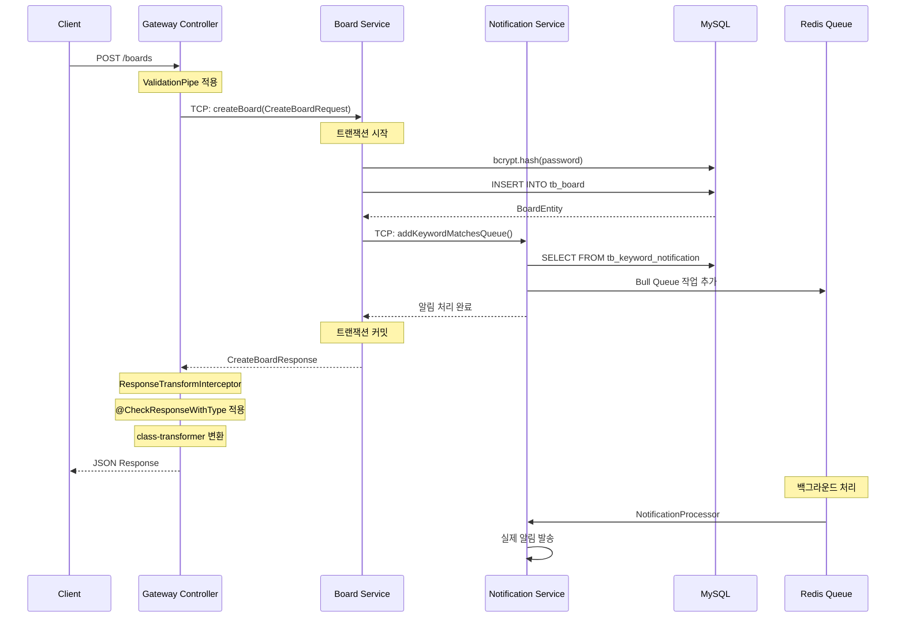
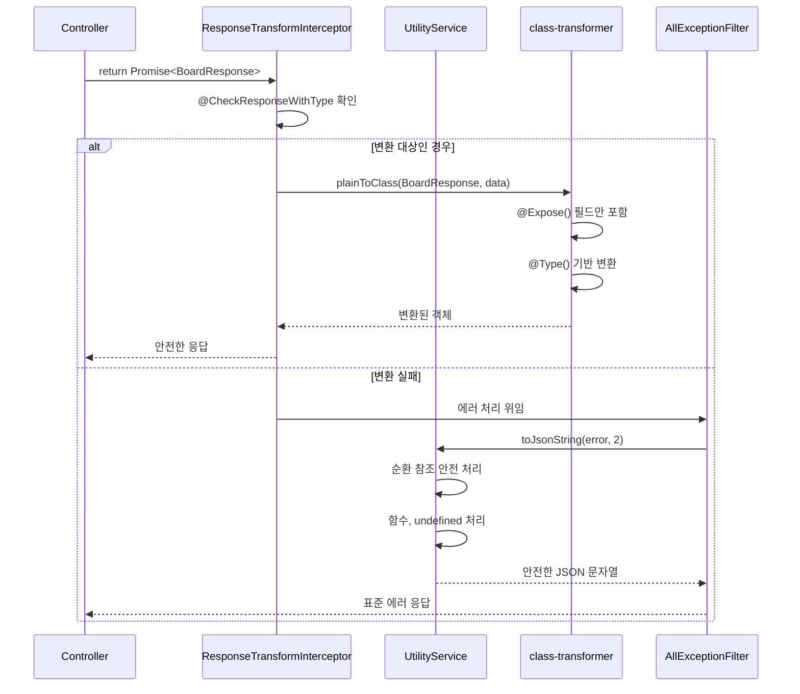

# API Interface - 익명 게시판 및 키워드 알림 시스템

## 📡 API 개요

**Base URL**: `http://localhost:3000`  
**API 문서**: `http://localhost:3000/api-docs` (Swagger UI)  
**아키텍처**: Gateway 패턴 (Gateway → Microservices)  
**통신 프로토콜**: HTTP → TCP (마이크로서비스 간)  
**Runtime**: Node.js v22 (LTS)  
**Framework**: NestJS v11 + Express v5  
**패키지 매니저**: pnpm v8  

## 🔧 공통 응답 형식

### 성공 응답

```json
{
  "boardId": 1,
  "title": "게시글 제목",
  "content": "게시글 내용",
  "author": "작성자명",
  "createdAt": "2024-01-01T00:00:00.000Z",
  "updatedAt": "2024-01-01T00:00:00.000Z"
}
```

### 에러 응답

```json
{
  "statusCode": 400,
  "message": "에러 메시지",
  "error": "Bad Request",
  "details": {
    "type": "ValidationError",
    "stack": "...",
    "originalError": "...",
    "fullException": "..."
  }
}
```

**에러 응답 특징**:
- `UtilityService.toJsonString()`으로 안전한 JSON 직렬화
- 순환 참조, 함수, undefined 등 안전하게 처리
- 개발 환경에서만 상세 정보 제공

## 📊 게시판 API

### 1. 게시글 관리

#### 1.1 게시글 작성

```http
POST /boards
Content-Type: application/json
```

**Request Body:**

```json
{
  "title": "게시글 제목",     // string, required, max: 255
  "content": "게시글 내용",   // string, required, max: 2000
  "author": "작성자명",       // string, required, max: 50
  "password": "1234"         // string, required, max: 255
}
```

**Response (CreateBoardResponse):**

```json
{
  "boardId": 1,
  "title": "게시글 제목",
  "content": "게시글 내용",
  "author": "작성자명",
  "createdAt": "2024-01-01T00:00:00.000Z",
  "updatedAt": "2024-01-01T00:00:00.000Z"
}
```

**Validation Rules:**
- `title`: `@IsNotEmpty`, `@MaxLength(255)`, `@StringTransform()`
- `content`: `@IsNotEmpty`, `@MaxLength(2000)`, `@StringTransform()`
- `author`: `@IsNotEmpty`, `@MaxLength(50)`, `@StringTransform()`
- `password`: `@IsNotEmpty`, `@MaxLength(255)`, bcrypt로 해시 저장

**비즈니스 로직:**
1. 입력 데이터 검증 (`class-validator`)
2. 비밀번호 bcrypt 해시화
3. 데이터베이스 저장 (트랜잭션)
4. 키워드 매칭 및 알림 트리거
5. 응답 DTO 변환 (`@CheckResponseWithType`)

#### 1.2 게시글 목록 조회

```http
GET /boards?page=1&limit=10&title=검색어&author=작성자
```

**Query Parameters:**
- `page`: 페이지 번호 (기본값: 1, `@NumberTransform()`)
- `limit`: 페이지당 게시글 수 (기본값: 10, `@NumberTransform()`)
- `title`: 제목 검색어 (선택, `@StringTransform()`)
- `author`: 작성자 검색어 (선택, `@StringTransform()`)

**Response (SelectBoardResponse):**

```json
{
  "boards": [
    {
      "boardId": 1,
      "title": "게시글 제목",
      "content": "게시글 내용",
      "author": "작성자명",
      "createdAt": "2024-01-01T00:00:00.000Z",
      "updatedAt": "2024-01-01T00:00:00.000Z"
    }
  ],
  "totalCount": 100
}
```

**데이터베이스 쿼리:**
```sql
SELECT * FROM tb_board 
WHERE title LIKE '%검색어%' 
  AND author LIKE '%작성자%'
ORDER BY created_at DESC 
LIMIT 10 OFFSET 0;
```

#### 1.3 게시글 수정

```http
PUT /boards/:boardId
Content-Type: application/json
```

**Path Parameters:**
- `boardId`: 게시글 ID (number, `@NumberTransform()`)

**Request Body:**

```json
{
  "title": "수정된 제목",     // string, required, max: 255
  "content": "수정된 내용",   // string, required, max: 2000
  "password": "1234"         // string, required (인증용)
}
```

**Response (UpdateBoardResponse):**

```json
{
  "boardId": 1,
  "title": "수정된 제목",
  "content": "수정된 내용",
  "author": "작성자명",
  "createdAt": "2024-01-01T00:00:00.000Z",
  "updatedAt": "2024-01-01T00:10:00.000Z"
}
```

**비즈니스 로직:**
1. 게시글 존재 여부 확인
2. 비밀번호 검증 (bcrypt.compare)
3. 데이터 업데이트 (트랜잭션)
4. 키워드 매칭 재실행
5. 응답 DTO 변환

#### 1.4 게시글 삭제

```http
DELETE /boards/:boardId
Content-Type: application/json
```

**Path Parameters:**
- `boardId`: 게시글 ID (number)

**Request Body:**

```json
{
  "password": "1234"  // string, required (인증용)
}
```

**Response:**

```json
"게시글 삭제 성공!!"
```

**비즈니스 로직:**
1. 게시글 존재 여부 확인
2. 비밀번호 검증
3. CASCADE 삭제 (댓글도 함께 삭제)

### 2. 댓글 관리

#### 2.1 댓글 작성

```http
POST /boards/:boardId/comments
Content-Type: application/json
```

**Path Parameters:**
- `boardId`: 게시글 ID (number)

**Request Body:**

```json
{
  "content": "댓글 내용",     // string, required, max: 2000
  "author": "작성자명",       // string, required, max: 50
  "parentId": null           // number, optional (대댓글인 경우)
}
```

**Response (CreateBoardCommentResponse):**

```json
{
  "commentId": 1,
  "boardId": 1,
  "parentId": null,
  "content": "댓글 내용",
  "author": "작성자명",
  "createdAt": "2024-01-01T00:00:00.000Z"
}
```

**계층형 댓글 구조:**
- `parentId`가 `null`인 경우: 일반 댓글
- `parentId`가 있는 경우: 대댓글
- 무제한 깊이 지원

#### 2.2 댓글 목록 조회

```http
GET /boards/:boardId/comments?page=1&limit=10
```

**Path Parameters:**
- `boardId`: 게시글 ID (number)

**Query Parameters:**
- `page`: 페이지 번호 (기본값: 1)
- `limit`: 페이지당 댓글 수 (기본값: 10)

**Response (SelectBoardCommentResponse):**

```json
{
  "comments": [
    {
      "commentId": 1,
      "boardId": 1,
      "parentId": null,
      "content": "댓글 내용",
      "author": "작성자명",
      "createdAt": "2024-01-01T00:00:00.000Z"
    },
    {
      "commentId": 2,
      "boardId": 1,
      "parentId": 1,
      "content": "대댓글 내용",
      "author": "다른작성자",
      "createdAt": "2024-01-01T00:05:00.000Z"
    }
  ],
  "totalCount": 25
}
```

## 🔔 알림 API (내부 통신)

### 1. 키워드 매칭 이벤트

```
Protocol: TCP (마이크로서비스 간)
Pattern: CustomMessagePatterns.AddKeywordMatchesQueue
```

**Event Payload:**

```typescript
interface NotificationCreateInput {
  title: string;
  content?: string;
  author: string;
  sourceType: SOURCE_TYPE;  // 'board' | 'comment'
  sourceId: number;
  keywords: string[];
  createdAt?: Date;
}
```

**키워드 매칭 로직:**
1. 게시글/댓글 작성 시 자동 실행
2. `title + content`에서 키워드 검색
3. 매칭된 키워드별로 알림 큐 작업 생성
4. Redis Bull Queue를 통한 비동기 처리

## 🏥 헬스체크 API

### 1. Gateway 헬스체크

```http
GET /health-check
```

**Response:**
```
"gateway api response test"
```

### 2. Board Service 헬스체크

```http
GET /board/health-check
```

**Response:**
```
"i am alive!!"
```

### 3. Notification Service 헬스체크

```http
GET /notification/health-check
```

**Response:**
```
"i am alive!!"
```

### 4. Test2 Service 헬스체크

```http
GET /test2/health-check
```

**Response:**
```
"i am alive!!"
```

## 📝 DTO 스키마 상세

### Request DTOs

#### CreateBoardRequest

```typescript
export class CreateBoardRequest {
  @ApiProperty({ description: '게시글 제목' })
  @IsNotEmpty()
  @MaxLength(255)
  @Type(() => String)
  @StringTransform()
  @IsString()
  title: string;

  @ApiProperty({ description: '게시글 내용' })
  @IsNotEmpty()
  @MaxLength(2000)
  @Type(() => String)
  @StringTransform()
  @IsString()
  content: string;

  @ApiProperty({ description: '게시글 작성자' })
  @IsNotEmpty()
  @MaxLength(50)
  @Type(() => String)
  @StringTransform()
  @IsString()
  author: string;

  @ApiProperty({ description: '게시글 비밀번호', example: '1234' })
  @IsNotEmpty()
  @MaxLength(255)
  @Type(() => String)
  @StringTransform()
  @IsString()
  password: string;
}
```

#### SelectBoardRequest

```typescript
export class SelectBoardRequest {
  @ApiProperty({ description: '게시글 페이지', default: 1, required: false })
  @IsOptional()
  @Type(() => Number)
  @NumberTransform()
  @IsNumber()
  page?: number = 1;

  @ApiProperty({ description: '게시글 페이지 당 최대 게시글 수', default: 10, required: false })
  @IsOptional()
  @Type(() => Number)
  @NumberTransform()
  @IsNumber()
  limit?: number = 10;

  @ApiProperty({ description: '게시글 제목 (검색용)', required: false })
  @IsOptional()
  @Type(() => String)
  @StringTransform()
  @MaxLength(255)
  @IsString()
  title?: string;

  @ApiProperty({ description: '게시글 작성자 (검색용)', required: false })
  @IsOptional()
  @Type(() => String)
  @StringTransform()
  @MaxLength(50)
  @IsString()
  author?: string;
}
```

### Response DTOs

#### BoardModel (Base)

```typescript
export class BoardModel {
  @ApiProperty({ description: '게시글 ID' })
  @Expose()
  @IsNotEmpty()
  @Type(() => Number)
  @IsNumber()
  boardId: number;

  @ApiProperty({ description: '게시글 제목' })
  @Expose()
  @IsNotEmpty()
  @Type(() => String)
  @StringTransform()
  @IsString()
  title: string;

  @ApiProperty({ description: '게시글 내용' })
  @Expose()
  @IsNotEmpty()
  @Type(() => String)
  @StringTransform()
  @IsString()
  content: string;

  @ApiProperty({ description: '게시글 작성자' })
  @Expose()
  @IsNotEmpty()
  @Type(() => String)
  @StringTransform()
  @IsString()
  author: string;

  @ApiProperty({ description: '게시글 작성일' })
  @Expose()
  @IsNotEmpty()
  @Type(() => Date)
  @IsDate()
  createdAt: Date;

  @ApiProperty({ description: '게시글 수정일', required: false })
  @Expose()
  @IsOptional()
  @Type(() => Date)
  @IsDate()
  updatedAt: Date;

  // password 필드는 @Expose() 없음 → 자동으로 응답에서 제외
}
```

#### SelectBoardResponse

```typescript
export class SelectBoardResponse {
  @ApiProperty({ description: '게시글 목록', type: SelectBoardModel, isArray: true })
  @Expose()
  @IsNotEmpty()
  @IsArray()
  @ValidateNested({ each: true })
  @Type(() => SelectBoardModel)
  boards: SelectBoardModel[];

  @ApiProperty({ description: '게시글 총 개수' })
  @Expose()
  @IsNotEmpty()
  @Type(() => Number)
  @NumberTransform()
  @IsNumber()
  totalCount: number;
}
```

## ⚠️ 에러 코드 및 처리

### HTTP 상태 코드

| 코드 | 설명        | 예시                   |
| ---- | ----------- | ---------------------- |
| 200  | 성공        | 조회, 수정, 삭제 성공  |
| 201  | 생성 성공   | 게시글, 댓글 작성 성공 |
| 400  | 잘못된 요청 | 유효성 검증 실패       |
| 401  | 인증 실패   | 비밀번호 불일치        |
| 404  | 리소스 없음 | 존재하지 않는 게시글   |
| 500  | 서버 에러   | 내부 서버 오류         |

### 커스텀 에러 메시지

#### 비밀번호 불일치

```json
{
  "statusCode": 401,
  "message": "비밀번호 다시 확인해주세요.",
  "error": "Unauthorized"
}
```

#### 유효성 검증 실패

```json
{
  "statusCode": 400,
  "message": [
    "title should not be empty",
    "content must be shorter than or equal to 2000 characters"
  ],
  "error": "Bad Request"
}
```

#### 응답 변환 실패 (개발 환경)

```json
{
  "statusCode": 500,
  "message": "RESPONSE_VALIDATION_ERROR",
  "error": "Server response validation failed",
  "details": {
    "type": "ValidationError",
    "stack": "Error: Validation failed...",
    "originalError": "{\"property\":\"boardId\",\"constraints\":{\"isNumber\":\"boardId must be a number\"}}",
    "fullException": "{\"name\":\"ValidationError\",\"message\":\"Validation failed\",\"errors\":[...]}"
  }
}
```

## 🔄 API 흐름도

### 1. 게시글 작성 API 흐름



### 2. 자동 검증/변환 플로우



## 🛠️ 개발 가이드

### 1. API 테스트

#### Swagger UI 사용

```bash
# 서버 실행 후 접속
http://localhost:3000/api-docs
```

#### curl 예시

```bash
# 게시글 작성
curl -X POST http://localhost:3000/boards \
  -H "Content-Type: application/json" \
  -d '{
    "title": "테스트 게시글",
    "content": "테스트 내용입니다. 키워드 알림 테스트를 위한 내용입니다.",
    "author": "홍길동",
    "password": "1234"
  }'

# 게시글 목록 조회
curl -X GET "http://localhost:3000/boards?page=1&limit=5&title=테스트"

# 게시글 수정
curl -X PUT http://localhost:3000/boards/1 \
  -H "Content-Type: application/json" \
  -d '{
    "title": "수정된 제목",
    "content": "수정된 내용",
    "password": "1234"
  }'

# 댓글 작성
curl -X POST http://localhost:3000/boards/1/comments \
  -H "Content-Type: application/json" \
  -d '{
    "content": "댓글 내용입니다.",
    "author": "김철수"
  }'
```

### 2. 환경별 설정

#### 개발 환경

```bash
NODE_ENV=dev pnpm run start:dev:gateway
NODE_ENV=dev pnpm run start:dev:board
NODE_ENV=dev pnpm run start:dev:notification
```

#### 프로덕션 환경

```bash
NODE_ENV=prod pnpm run start:prod:gateway
NODE_ENV=prod pnpm run start:prod:board
NODE_ENV=prod pnpm run start:prod:notification
```

### 3. 로깅 및 디버깅

#### 응답 변환 로그

```typescript
// 성공 시
console.log(`✅ Response validated [BoardController.createBoard]:`, transformedData);

// 실패 시
console.error(`❌ Validation failed [BoardController.createBoard]:`, 
  this.utilityService.toJsonString(errors, 2));
```

#### 에러 로그

```typescript
// AllExceptionFilter에서 자동 로깅
console.error('🚨 Exception caught:', {
  type: exception?.constructor?.name,
  message: exception?.message,
  stack: exception?.stack,
  fullException: this.utilityService?.toJsonString(exception, 2)
});
```

## 📈 성능 고려사항

### 1. 페이징 최적화

- **최대 limit**: 100개로 제한
- **기본 페이지 크기**: 10개
- **인덱스 활용**: `idx_created_at`, `idx_title`, `idx_author`

### 2. 응답 시간 목표

- **조회 API**: < 200ms
- **작성/수정 API**: < 500ms
- **키워드 매칭**: 비동기 처리로 응답 시간에 영향 없음

### 3. 동시 처리

- **최대 동시 사용자**: 100명
- **커넥션 풀**: TypeORM 기본 설정 사용
- **Redis Queue**: 알림 처리 부하 분산

### 4. 캐싱 전략

```typescript
// 향후 구현 예정
@Cacheable('boards', 60) // 60초 캐시
async findPopularBoards(): Promise<BoardEntity[]> {
  return this.boardRepository.findPopularBoards();
}
```

## 🔄 NestJS v11 & Express v5 특징

### 1. Express v5 라우팅 개선

- **성능 향상**: 더 빠른 라우팅 처리
- **타입 안전성**: 강화된 타입 정의
- **미들웨어**: 향상된 미들웨어 지원

### 2. NestJS v11 새 기능

- **향상된 DI**: 더 효율적인 의존성 주입
- **메타데이터 최적화**: 더 빠른 메타데이터 처리
- **타입 추론**: 향상된 TypeScript 지원

### 3. 성능 개선사항

- **V8 엔진**: Node.js v22의 최적화된 성능
- **메모리 관리**: 더 효율적인 메모리 사용
- **HTTP 처리**: 향상된 HTTP 요청 처리

## 🔒 보안 고려사항

### 1. 입력 데이터 검증

```typescript
// class-validator를 통한 자동 검증
@IsString()
@MaxLength(255)
@Transform(({ value }) => value?.trim()) // 공백 제거
title: string;
```

### 2. 비밀번호 보안

```typescript
// bcrypt 해시 사용
const hashedPassword = await bcrypt.hash(password, 10);

// 비밀번호 검증
const isValid = await bcrypt.compare(inputPassword, hashedPassword);
```

### 3. 응답 데이터 보안

```typescript
// @Expose() 데코레이터로 노출 필드 제어
export class BoardModel {
  @Expose() title: string;
  @Expose() content: string;
  password: string; // 자동으로 응답에서 제외
}
```

### 4. SQL Injection 방지

- TypeORM QueryBuilder 사용
- 파라미터 바인딩으로 안전한 쿼리 실행

### 5. XSS 방지

- 입력 데이터 자동 이스케이프
- HTML 태그 필터링 (향후 구현 예정)

## 🚀 확장 계획

### 1. 인증/인가 시스템

```typescript
// JWT 기반 인증 (향후 구현)
@UseGuards(JwtAuthGuard)
@Post('boards')
async createBoard(@User() user: UserEntity, @Body() dto: CreateBoardRequest) {
  return this.boardService.createBoard(dto, user);
}
```

### 2. 파일 업로드

```typescript
// 이미지 업로드 (향후 구현)
@Post('boards/:id/images')
@UseInterceptors(FileInterceptor('file'))
async uploadImage(@Param('id') id: number, @UploadedFile() file: Express.Multer.File) {
  return this.boardService.uploadImage(id, file);
}
```

### 3. 실시간 알림

```typescript
// WebSocket 기반 실시간 알림 (향후 구현)
@WebSocketGateway()
export class NotificationGateway {
  @SubscribeMessage('subscribe-notifications')
  handleSubscribe(@MessageBody() data: { userId: string }) {
    // 실시간 알림 구독
  }
}
```

### 4. API 버전 관리

```typescript
// 향후 API 버전 관리
@Controller({ path: 'boards', version: '1' })
export class BoardV1Controller { }

@Controller({ path: 'boards', version: '2' })
export class BoardV2Controller { }
```