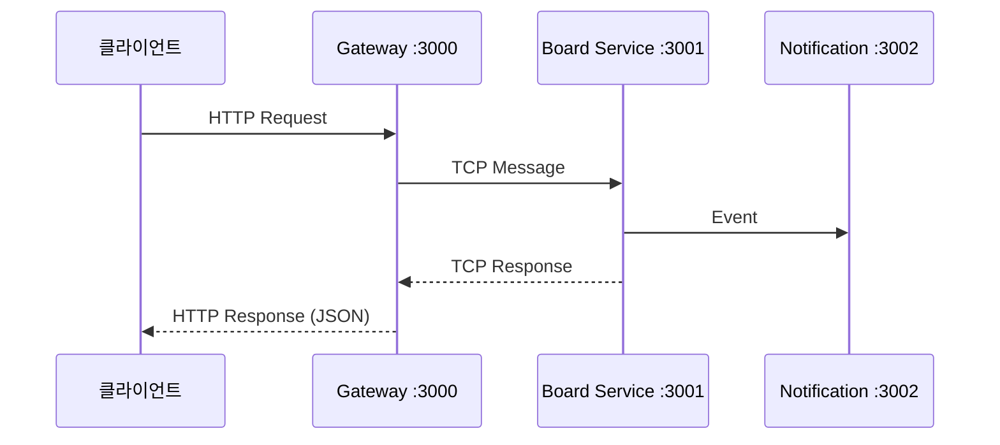

# API Interface - REST API 명세서

## 🌐 API 개요

**프로젝트**: NestJS 마이크로서비스 스켈레톤 프로젝트  
**API 타입**: RESTful API  
**베이스 URL**: `http://localhost:3000`  
**API 문서**: `http://localhost:3000/api-docs` (Swagger UI) ⭐  
**프로토콜**: HTTP/HTTPS  
**인증 방식**: 비밀번호 기반 (게시글 수정/삭제)  
**응답 형식**: JSON

> 💡 **중요**: 상세한 API 스키마와 실시간 테스트는 **[Swagger UI](http://localhost:3000/api-docs)**를 사용하세요!

## 🏗️ API 아키텍처

### 요청 플로우



### 자동화된 응답 시스템

- **타입 변환**: `@CheckResponseWithType` 데코레이터로 자동 검증
- **필드 제외**: `@Expose()` 없는 필드 자동 제외 (ex: password)
- **에러 처리**: 3단계 예외 방어 시스템

## 📋 API 엔드포인트 목록

### 🏥 시스템 API (Gateway)

| 엔드포인트       | 메서드 | 설명                         | 응답 타입 |
| ---------------- | ------ | ---------------------------- | --------- |
| `/health-check`  | GET    | Gateway 헬스체크             | `String`  |
| `/health`        | GET    | 시스템 상태 (메모리, uptime) | `Object`  |
| `/health/ping`   | GET    | Ping 테스트                  | `Object`  |
| `/health/status` | GET    | 서비스 정보                  | `Object`  |

### 🔗 마이크로서비스 헬스체크

| 엔드포인트                   | 메서드 | 설명                     | 응답 타입 |
| ---------------------------- | ------ | ------------------------ | --------- |
| `/board/health-check`        | GET    | Board 서비스 상태        | `String`  |
| `/notification/health-check` | GET    | Notification 서비스 상태 | `String`  |
| `/scheduler/health-check`    | GET    | Scheduler 서비스 상태    | `String`  |

### 📝 게시판 API (예시 구현)

| 엔드포인트         | 메서드 | 설명             | 요청 DTO             | 응답 DTO              |
| ------------------ | ------ | ---------------- | -------------------- | --------------------- |
| `/boards`          | POST   | 게시글 작성      | `CreateBoardRequest` | `CreateBoardResponse` |
| `/boards`          | GET    | 게시글 목록 조회 | `SelectBoardRequest` | `SelectBoardResponse` |
| `/boards/:boardId` | PUT    | 게시글 수정      | `UpdateBoardRequest` | `UpdateBoardResponse` |
| `/boards/:boardId` | DELETE | 게시글 삭제      | `DeleteBoardRequest` | `String`              |

### 💬 댓글 API (예시 구현)

| 엔드포인트                  | 메서드 | 설명             | 요청 DTO                | 응답 DTO                     |
| --------------------------- | ------ | ---------------- | ----------------------- | ---------------------------- |
| `/boards/:boardId/comments` | POST   | 댓글/대댓글 작성 | `CreateBoardCommentDto` | `CreateBoardCommentResponse` |
| `/boards/:boardId/comments` | GET    | 댓글 목록 조회   | `SelectBoardCommentDto` | `SelectBoardCommentResponse` |

## 🔧 새로운 API 추가 패턴

### API 엔드포인트 네이밍 규칙

**RESTful 패턴**:

- `GET /{resource}` - 목록 조회
- `GET /{resource}/:id` - 단일 조회
- `POST /{resource}` - 생성
- `PUT /{resource}/:id` - 수정
- `DELETE /{resource}/:id` - 삭제

**중첩 리소스**:

- `GET /{parent}/:parentId/{child}` - 부모-자식 관계

### DTO 네이밍 규칙

**요청 DTO**: `{Action}{Resource}Request`

- 예: `CreateUserRequest`, `UpdateBoardRequest`

**응답 DTO**: `{Action}{Resource}Response` 또는 `{Resource}Model`

- 예: `CreateUserResponse`, `UserModel`

### 새 서비스 API 추가 템플릿

```markdown
### 🔧 {ServiceName} API

| 엔드포인트    | 메서드 | 설명                 | 요청 DTO                  | 응답 DTO                   |
| ------------- | ------ | -------------------- | ------------------------- | -------------------------- |
| `/{resource}` | GET    | {resource} 목록 조회 | `Select{Resource}Request` | `Select{Resource}Response` |
| `/{resource}` | POST   | {resource} 생성      | `Create{Resource}Request` | `Create{Resource}Response` |
```

## 🚀 API 테스트

### 기본 헬스체크

```bash
# 시스템 상태 확인
curl http://localhost:3000/health-check
curl http://localhost:3000/health
```

### 게시판 API 예시

```bash
# 게시글 작성
curl -X POST http://localhost:3000/boards \
  -H "Content-Type: application/json" \
  -d '{"title":"제목","content":"내용","author":"작성자","password":"1234"}'

# 게시글 목록 조회
curl "http://localhost:3000/boards?page=1&limit=10"

# 댓글 작성
curl -X POST http://localhost:3000/boards/1/comments \
  -H "Content-Type: application/json" \
  -d '{"author":"댓글작성자","content":"댓글내용"}'
```

## 🔐 보안 및 검증

- **비밀번호 인증**: bcrypt 해시 사용
- **자동 검증**: class-validator + TypeORM
- **응답 보안**: 민감 정보 자동 제외

## ⚠️ 개발 가이드라인

1. **Swagger First**: 모든 API는 Swagger로 문서화
2. **자동화 우선**: `@CheckResponseWithType` 데코레이터 사용
3. **타입 안전성**: TypeScript + DTO 패턴

---

**📚 실제 API 개발 시에는 반드시 [Swagger UI](http://localhost:3000/api-docs)를 참고하세요!**

> **참고**: 게시판 기능은 스켈레톤 프로젝트의 **예시 구현**입니다. 실제 프로젝트에서는 필요한 기능으로 대체하여 사용하세요.

**Made with ❤️ using NestJS v11, TypeScript, and Swagger**
