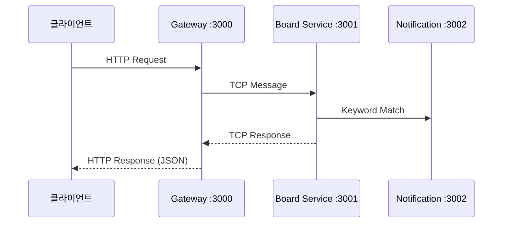

# API Interface - REST API 명세서

## 🌐 API 개요

**프로젝트**: 익명 게시판 및 키워드 알림 시스템  
**API 타입**: RESTful API  
**베이스 URL**: `http://localhost:3000`  
**API 문서**: `http://localhost:3000/api-docs` (Swagger UI) ⭐  
**프로토콜**: HTTP/HTTPS  
**인증 방식**: 비밀번호 기반 (게시글 수정/삭제)  
**응답 형식**: JSON

> 💡 **중요**: 상세한 API 스키마와 실시간 테스트는 **[Swagger UI](http://localhost:3000/api-docs)**를 사용하세요!

## 🏗️ API 아키텍처

### 요청 플로우



### 자동화된 응답 시스템

- **타입 변환**: `@CheckResponseWithType` 데코레이터로 자동 검증
- **필드 제외**: `@Expose()` 없는 필드 자동 제외 (ex: password)
- **에러 처리**: 3단계 예외 방어 시스템

## 📋 API 엔드포인트 개요

### 시스템 API

| 엔드포인트       | 메서드 | 설명                         | 비고               |
| ---------------- | ------ | ---------------------------- | ------------------ |
| `/health-check`  | GET    | Gateway 헬스체크             | 간단한 상태 확인   |
| `/health`        | GET    | 시스템 상태 (메모리, uptime) | 상세 모니터링      |
| `/health/ping`   | GET    | Ping 테스트                  | 네트워크 연결 확인 |
| `/health/status` | GET    | 서비스 정보                  | 버전, 환경 정보    |

### 마이크로서비스 헬스체크

| 엔드포인트                   | 메서드 | 설명                     | 프록시 대상        |
| ---------------------------- | ------ | ------------------------ | ------------------ |
| `/board/health-check`        | GET    | Board 서비스 상태        | Board :3001        |
| `/notification/health-check` | GET    | Notification 서비스 상태 | Notification :3002 |
| `/test2/health-check`        | GET    | Test2 서비스 상태        | Test2 :3003        |

### 게시판 API

| 엔드포인트         | 메서드 | 설명             | 인증     | 주요 기능                  |
| ------------------ | ------ | ---------------- | -------- | -------------------------- |
| `/boards`          | POST   | 게시글 작성      | -        | 키워드 알림 자동 트리거    |
| `/boards`          | GET    | 게시글 목록 조회 | -        | 페이징, 검색 (제목/작성자) |
| `/boards/:boardId` | PUT    | 게시글 수정      | 비밀번호 | bcrypt 인증                |
| `/boards/:boardId` | DELETE | 게시글 삭제      | 비밀번호 | bcrypt 인증                |

### 댓글 API

| 엔드포인트                  | 메서드 | 설명             | 주요 기능                |
| --------------------------- | ------ | ---------------- | ------------------------ |
| `/boards/:boardId/comments` | POST   | 댓글/대댓글 작성 | 계층형 구조, 키워드 알림 |
| `/boards/:boardId/comments` | GET    | 댓글 목록 조회   | 계층형 조회, 페이징      |

## 🚀 빠른 시작 가이드

### 1. 기본 API 테스트

```bash
# 헬스체크
curl http://localhost:3000/health-check

# 시스템 상태 확인
curl http://localhost:3000/health
```

### 2. 게시글 작성

```bash
curl -X POST http://localhost:3000/boards \
  -H "Content-Type: application/json" \
  -d '{
    "title": "첫 번째 게시글",
    "content": "안녕하세요!",
    "author": "홍길동",
    "password": "1234"
  }'
```

### 3. 게시글 목록 조회

```bash
# 기본 조회
curl "http://localhost:3000/boards"

# 검색 및 페이징
curl "http://localhost:3000/boards?page=1&limit=5&title=안녕&author=홍길동"
```

### 4. 댓글 작성

```bash
# 일반 댓글
curl -X POST http://localhost:3000/boards/1/comments \
  -H "Content-Type: application/json" \
  -d '{
    "author": "김철수",
    "content": "좋은 글이네요!"
  }'

# 대댓글
curl -X POST http://localhost:3000/boards/1/comments \
  -H "Content-Type: application/json" \
  -d '{
    "parentId": 1,
    "author": "이영희",
    "content": "저도 동감합니다."
  }'
```

## 📖 상세 API 명세

> ⚠️ **중요**: 아래는 기본적인 구조입니다. **실제 필드 상세 정보, 검증 규칙, 에러 코드**는 반드시 **[Swagger UI](http://localhost:3000/api-docs)**에서 확인하세요!

### 요청/응답 DTO 구조

**게시글 작성 요청**:

```typescript
CreateBoardRequest {
  title: string      // 제목 (최대 255자)
  content: string    // 내용 (최대 2000자)
  author: string     // 작성자 (최대 50자)
  password: string   // 비밀번호 (bcrypt 해시화)
}
```

**게시글 응답**:

```typescript
BoardModel {
  boardId: number
  title: string
  content: string
  author: string
  createdAt: Date
  updatedAt: Date
  // password 필드는 자동으로 응답에서 제외됨
}
```

**댓글 구조** (계층형):

```typescript
CommentModel {
  commentId: number
  boardId: number
  parentId?: number      // 대댓글인 경우
  author: string
  content: string
  createdAt: Date
  children: CommentModel[]  // 대댓글 목록
}
```

## 🔐 인증 및 보안

### 비밀번호 인증

- **게시글 수정/삭제 시**: 작성 시 설정한 비밀번호 필요
- **암호화**: bcrypt 해시 사용 (salt 자동 생성)
- **응답 보안**: password 필드 자동 제외

### 입력 검증

- **자동 검증**: class-validator 사용
- **SQL Injection 방지**: TypeORM 사용
- **XSS 방지**: 입력 데이터 이스케이프

## 🎯 키워드 알림 시스템

### 자동 동작

1. 게시글/댓글 작성 시 자동 실행
2. 제목 + 내용에서 등록된 키워드 검색
3. Redis Bull Queue로 비동기 처리
4. 매칭된 키워드별 개별 알림 생성

### 테스트용 키워드 데이터

```sql
-- 초기 키워드 데이터
INSERT INTO tb_keyword_notification (author, keyword) VALUES
('홍길동', '테스트'),
('홍길동', '안녕'),
('김철수', 'NestJS'),
('이영희', '마이크로서비스');
```

## 🛠️ 개발 도구

### Swagger UI (필수! ⭐)

**URL**: http://localhost:3000/api-docs

**제공 기능**:

- 📋 **실시간 API 스키마**: 모든 필드 타입, 검증 규칙
- 🧪 **API 테스트**: 브라우저에서 직접 테스트
- 📚 **자동 문서화**: 코드 변경 시 자동 업데이트
- 🔍 **요청/응답 예시**: 실제 데이터 형태 확인

### 기타 도구

- **Postman**: API 컬렉션 관리
- **cURL**: 명령행 기반 테스트
- **HTTPie**: 사용자 친화적 HTTP 클라이언트

## 📊 API 사용 패턴

### 일반적인 워크플로우

```bash
# 1. 시스템 상태 확인
curl http://localhost:3000/health-check

# 2. 게시글 작성
curl -X POST http://localhost:3000/boards -H "Content-Type: application/json" \
  -d '{"title":"제목","content":"내용","author":"작성자","password":"1234"}'

# 3. 목록 확인
curl "http://localhost:3000/boards?page=1&limit=10"

# 4. 댓글 작성
curl -X POST http://localhost:3000/boards/1/comments -H "Content-Type: application/json" \
  -d '{"author":"댓글작성자","content":"댓글내용"}'

# 5. 게시글 수정 (비밀번호 필요)
curl -X PUT http://localhost:3000/boards/1 -H "Content-Type: application/json" \
  -d '{"title":"수정제목","content":"수정내용","password":"1234"}'
```

## 📈 성능 최적화

### API 응답 최적화

- **자동 타입 변환**: 메타데이터 캐싱
- **페이징 처리**: 대용량 데이터 효율적 조회
- **인덱스 활용**: 검색 성능 최적화

### 캐싱 전략 (향후)

- **Redis 캐싱**: 자주 조회되는 게시글
- **CDN**: 정적 자원 최적화

## 🔮 향후 API 확장

### 계획된 기능

- **JWT 인증**: 사용자 세션 관리
- **파일 업로드**: 이미지 첨부 API
- **실시간 알림**: WebSocket API
- **API 버전 관리**: v1, v2 지원

### 모니터링 API

- **메트릭 수집**: 성능 지표 API
- **고도화된 헬스체크**: 상세 시스템 상태

## ⚠️ 중요한 가이드라인

### API 설계 원칙

1. **Swagger First**: 모든 API는 Swagger로 문서화
2. **자동화 우선**: `@CheckResponseWithType` 데코레이터 사용
3. **보안 기본**: 민감 정보 자동 제외
4. **타입 안전성**: TypeScript + class-validator

### 개발 워크플로우

1. **DTO 정의**: Request/Response 타입 정의
2. **컨트롤러 구현**: `@CheckResponseWithType` 적용
3. **Swagger 확인**: API 문서 자동 생성 검증
4. **테스트**: Swagger UI에서 기능 테스트

---

**📚 실제 API 개발 시에는 반드시 [Swagger UI](http://localhost:3000/api-docs)를 참고하세요!**

**Made with ❤️ using NestJS v11, TypeScript, and Swagger**
