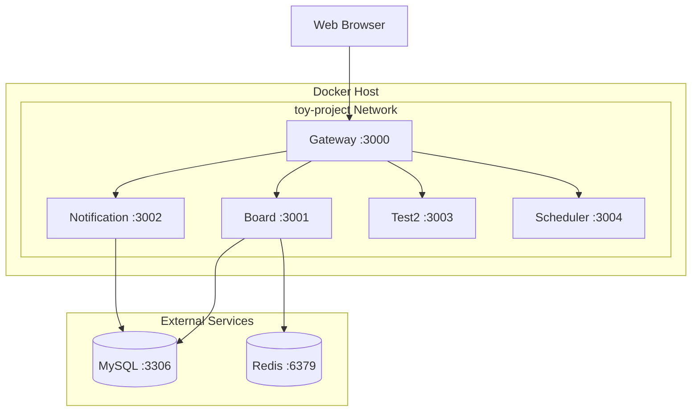

# Docker Configuration - 컨테이너화 가이드

## 🐳 Docker 개요

**컨테이너화 도구**: Docker + Docker Compose  
**베이스 이미지**: Node.js v22 Alpine  
**빌드 시스템**: SWC 컴파일러 + pnpm v8.15.6  
**네트워크**: 기본 네트워크 사용 (커스텀 네트워크 제거)  
**외부 서비스**: MySQL, Redis (컨테이너 외부)

## 📊 현재 컨테이너 구성

### 서비스 목록

| 서비스           | 컨테이너명     | 포트 | 역할                         | 통신 방식 |
| ---------------- | -------------- | ---- | ---------------------------- | --------- |
| **Gateway**      | `gateway`      | 3000 | API Gateway, HTTP 엔드포인트 | HTTP      |
| **Board**        | `board`        | 3001 | 게시판 마이크로서비스        | TCP       |
| **Notification** | `notification` | 3002 | 알림 마이크로서비스          | TCP       |
| **Test2**        | `test2`        | 3003 | 테스트 마이크로서비스        | TCP       |
| **Scheduler**    | `scheduler`    | 3004 | 스케줄링 마이크로서비스      | TCP       |

### 아키텍처 구조



## 🔧 Docker 구성 파일

### docker-compose.yml 핵심 구조

```yaml
# 간소화된 구성
name: toy-project

# 공통 환경변수 (YAML 앵커 패턴)
x-common-env: &common-env
  NODE_ENV: ${NODE_ENV:-dev}
  DB_HOST: ${DB_HOST:-localhost}    # 외부 서비스
  REDIS_HOST: ${REDIS_HOST:-localhost}

services:
  gateway:
    container_name: gateway
    ports: ['3000:3000']
    environment: <<: *common-env

  board:
    container_name: board
    ports: ['3001:3001']
    environment: <<: *common-env
    command: ['node', 'dist/apps/board/main.js']

  notification:
    container_name: notification
    ports: ['3002:3002']
    environment: <<: *common-env
    command: ['node', 'dist/apps/notification/main.js']

  test2:
    container_name: test2
    ports: ['3003:3003']
    environment: <<: *common-env
    command: ['node', 'dist/apps/test2/main.js']
```

### Dockerfile 최적화 포인트

```dockerfile
# 멀티스테이지 빌드 + pnpm 8버전 고정
FROM node:22-alpine AS deps
RUN corepack enable && corepack prepare pnpm@8.15.6 --activate
RUN pnpm install --frozen-lockfile

FROM node:22-alpine AS builder
RUN pnpm run build ${TARGET_APPS} --builder swc

FROM node:22-alpine AS app
COPY --from=builder /app/dist ./dist
CMD ["node", "dist/apps/${APP_NAME}/main.js"]
```

**핵심 최적화**:

- ✅ **pnpm 8.15.6 고정**: 일관된 의존성 관리
- ✅ **SWC 컴파일러**: 15.6% 빌드 성능 향상
- ✅ **멀티스테이지**: 최종 이미지 크기 최소화
- ✅ **Alpine Linux**: 경량 베이스 이미지

## 🚀 Docker 사용법

### 기본 관리 스크립트 (docker.sh)

```bash
# 실행 권한 부여
chmod +x docker.sh

# 전체 시스템 시작
./docker.sh dev up -d

# 특정 서비스만 시작
./docker.sh dev gateway

# 로그 확인
./docker.sh dev logs gateway
./docker.sh dev logs -f board  # 실시간

# 상태 확인
./docker.sh dev ps

# 서비스 중지
./docker.sh dev down
```

### 환경별 실행

```bash
./docker.sh dev up -d      # 개발 환경
./docker.sh qa up -d       # QA 환경
./docker.sh prod up -d     # 프로덕션 환경
```

### 직접 docker-compose 사용

```bash
# 기본 명령어 (환경변수 파일 없이도 가능)
docker-compose up -d
docker-compose logs gateway
docker-compose ps
docker-compose down

# 직접 컨테이너 접근
docker logs gateway
docker exec -it gateway sh
```

## 🔧 환경별 설정

### 환경 파일 구조

```
env/
├── dev.env     # 개발 환경 (기본값)
├── qa.env      # QA 환경 (포트 4000-4003)
└── prod.env    # 프로덕션 환경
```

### 주요 환경변수

```bash
# 서비스 포트
GATEWAY_SERVICE_PORT=3000
BOARD_SERVICE_PORT=3001
NOTIFICATION_SERVICE_PORT=3002
TEST2_SERVICE_PORT=3003

# 외부 서비스 (Docker 외부)
DB_HOST=localhost
DB_PORT=3306
REDIS_HOST=localhost
REDIS_PORT=6379
```

## 🛠️ 개발 워크플로우

### 일반적인 개발 순서

```bash
# 1. 코드 변경 후 빌드
pnpm run build:all:swc

# 2. 특정 서비스 재시작
./docker.sh dev restart board

# 3. 로그 확인
./docker.sh dev logs -f board

# 4. API 테스트
curl http://localhost:3000/health-check
```

### 배포 프로세스

```bash
# 개발 환경
pnpm run build:all:swc
./docker.sh dev up -d --build

# QA 환경
./docker.sh qa up -d --build

# 프로덕션 환경
NODE_ENV=prod pnpm run build:all:swc
./docker.sh prod up -d --build
```

## 🔍 트러블슈팅

### 일반적인 문제

**포트 충돌**:

```bash
# 포트 사용 중인 프로세스 확인 및 종료
lsof -ti:3000,3001,3002,3003 | xargs kill -9
```

**빌드 실패**:

```bash
# Docker 캐시 클리어 후 재빌드
docker system prune -a
./docker.sh dev up -d --build --no-cache
```

**환경변수 문제**:

```bash
# 설정 검증
./docker.sh dev config
cat env/dev.env
```

### 로그 확인

```bash
# 에러 로그 필터링
./docker.sh dev logs gateway | grep ERROR

# 시스템 리소스 확인
docker stats

# 컨테이너 상태 확인
docker ps -a
```

## 📈 성능 최적화

### 빌드 최적화

- **SWC 컴파일러**: TypeScript 컴파일 15.6% 성능 향상
- **pnpm 캐시**: `--mount=type=cache` 활용
- **멀티스테이지**: 의존성 설치와 빌드 분리

### 런타임 최적화

- **Alpine Linux**: 경량 베이스 이미지
- **최소 권한**: 비root 사용자 실행
- **리소스 제한**: 필요 시 메모리/CPU 제한

## 🔒 보안 고려사항

### 컨테이너 보안

- ✅ **최신 베이스 이미지**: Node.js v22 Alpine
- ✅ **비root 실행**: 기본 node 사용자
- ✅ **최소 포트 노출**: 필요한 포트만 공개
- ✅ **소스코드 분리**: 최종 이미지에 소스코드 미포함

### 환경변수 보안

```bash
# 민감한 정보는 별도 관리
export PROD_DB_PASSWORD="secure_password"
./docker.sh prod up -d
```

## 🔮 향후 개선 계획

### Kubernetes 마이그레이션

- **Helm 차트**: 배포 자동화
- **ConfigMap/Secret**: 설정 및 민감정보 관리
- **HPA**: 자동 스케일링

### CI/CD 파이프라인

- **GitHub Actions**: 자동 빌드 및 배포
- **이미지 스캔**: 보안 취약점 검사
- **자동 테스트**: E2E 테스트 자동화

### 모니터링

- **Prometheus**: 메트릭 수집
- **Grafana**: 시각화 대시보드
- **Jaeger**: 분산 트레이싱

---

> 💡 **AI 지시 시 참고**:
>
> - 새 서비스 추가: docker-compose.yml에 서비스 블록 추가
> - 포트 규칙: 3000번대 순차 할당
> - 환경변수: `x-common-env` 앵커 패턴 사용
> - 컨테이너명: 단순명 사용 (toy-project- 접두사 제거)
> - 외부 서비스: MySQL, Redis는 Docker 외부 사용

**Docker 기반 마이크로서비스 컨테이너화 완료 🐳**
