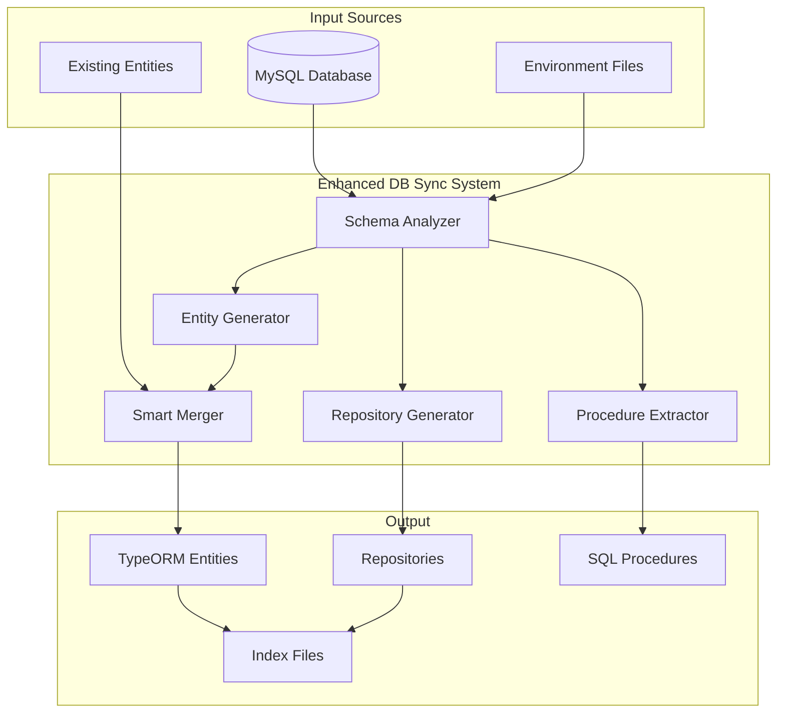

# Enhanced DB Sync System - 자동화된 데이터베이스 동기화 시스템

## 🎯 개요

**Enhanced DB Sync System**은 MySQL 데이터베이스 스키마를 분석하여 TypeORM Entity와 Repository를 자동으로 생성하는 완전 자동화된 시스템입니다.

### 핵심 특징

- **🔍 완전 자동화**: DB 스키마 → Entity → Repository 전체 과정 자동화
- **🛡️ 안전한 병합**: 기존 수동 코드 보존하며 스키마 변경사항만 반영
- **🗑️ 삭제된 테이블 감지**: DB에서 삭제된 테이블에 `@deprecated` 주석 자동 추가
- **📦 스마트 Import**: 수동으로 추가된 TypeORM 데코레이터 자동 감지 및 Import 추가
- **🔄 관계 매핑**: 외래키 기반 자동 관계 생성 (OneToMany, ManyToOne, CASCADE)
- **🐍 Snake_case 지원**: DB의 snake_case 컬럼을 camelCase Entity 필드로 자동 매핑

## 🏗️ 시스템 아키텍처



## 🚀 사용 방법

### 1. 기본 실행 (권장)

```bash
# 개발 환경에서 실행 (병합 모드)
./scripts/run-enhanced-db-sync.sh dev

# QA 환경에서 실행
./scripts/run-enhanced-db-sync.sh qa

# 운영 환경에서 실행
./scripts/run-enhanced-db-sync.sh prod
```

### 2. 고급 옵션

```bash
# 테스트 실행 (파일 생성 안함)
./scripts/run-enhanced-db-sync.sh dev --dry-run

# 강제 덮어쓰기 (기존 파일 완전 재생성)
./scripts/run-enhanced-db-sync.sh dev --overwrite

# Repository만 생성 (Entity 스킵)
./scripts/run-enhanced-db-sync.sh dev --skip-entities

# Entity만 생성 (Repository 스킵)
./scripts/run-enhanced-db-sync.sh dev --skip-repositories

# Procedure 추출 스킵
./scripts/run-enhanced-db-sync.sh dev --skip-procedures
```

### 3. GitHub Actions 자동화

```yaml
# .github/workflows/db-sync.yml
name: 🚀 Enhanced Database Schema Sync

on:
  workflow_dispatch:
    inputs:
      environment:
        description: 'Target environment'
        required: true
        default: 'dev'
        type: choice
        options: [dev, qa, prod]
```

## 🔧 핵심 컴포넌트

### 1. Enhanced Schema Analyzer

**파일**: `scripts/db-analyzer/enhanced-schema-analyzer.ts`

**기능**:

- MySQL INFORMATION_SCHEMA 분석
- 테이블, 컬럼, 인덱스, 외래키 정보 수집
- Stored Procedure 및 Function 목록 추출

**주요 메서드**:

```typescript
class EnhancedSchemaAnalyzer {
  async analyzeSchema(): Promise<SchemaAnalysisResult>;
  private async analyzeTables(): Promise<TableInfo[]>;
  private async getTableColumns(tableName: string): Promise<ColumnInfo[]>;
  private async getTableIndexes(tableName: string): Promise<IndexInfo[]>;
  private async getTableForeignKeys(
    tableName: string,
  ): Promise<ForeignKeyInfo[]>;
}
```

### 2. Enhanced Entity Generator

**파일**: `scripts/db-analyzer/enhanced-entity-generator.ts`

**기능**:

- TypeORM Entity 클래스 자동 생성
- Snake_case → camelCase 자동 변환
- 관계 매핑 (OneToMany, ManyToOne, JoinColumn)
- 기존 수동 코드와 스마트 병합

**핵심 기능**:

#### A. 스마트 병합 모드

```typescript
// 기존 파일이 있으면 병합, 없으면 새로 생성
if (existingContent && !this.options.overwrite) {
  entityContent = await this.mergeEntityContent(table, existingContent);
  console.log(`🔄 Merged with existing ${fileName}`);
} else {
  entityContent = this.generateEntityContent(table);
}
```

#### B. 수동 관계 보존

```typescript
// DB 컬럼에 없는 OneToMany 관계 자동 감지
private extractManualRelations(content: string, table: TableInfo): string[] {
  const oneToManyRegex = /@OneToMany\([^)]+\)[^;]*;/gs;
  // 수동으로 추가된 관계만 추출하여 보존
}
```

#### C. TypeORM Import 자동 추가

```typescript
// 수동으로 추가된 데코레이터 감지
private extractManualTypeOrmImports(content: string): Set<string> {
  const decoratorPatterns = [
    /@OneToMany\s*\(/g,
    /@ManyToMany\s*\(/g,
    /@JoinTable\s*\(/g,
    /@JoinColumn\s*\(/g,
  ];
  // 필요한 Import 자동 추가
}
```

### 3. Enhanced Repository Generator

**파일**: `scripts/db-analyzer/enhanced-repository-generator.ts`

**기능**:

- Repository 클래스 자동 생성
- 기존 Repository 보존 (덮어쓰지 않음)
- 새로운 테이블에 대해서만 Repository 생성

### 4. 삭제된 테이블 감지 시스템

**기능**:

- DB에서 삭제된 테이블 자동 감지
- 해당 Entity와 Repository에 `@deprecated` 주석 자동 추가
- 안전한 하위 호환성 보장

**예시**:

```typescript
/**
 * @deprecated This table has been deleted from the database.
 * This entity is kept for backward compatibility but should not be used.
 * 이 테이블은 데이터베이스에서 삭제되었습니다.
 * 기존 코드 호환성을 위해 유지되지만 사용하지 마세요.
 *
 * Deletion detected on: 2025-09-13
 */
@Entity('tb_deleted_table')
export class TbDeletedTableEntity {
  // ...
}
```

## 📁 생성되는 파일 구조

```
libs/database/src/
├── entities/
│   ├── tb-board.entity.ts          # 게시판 Entity
│   ├── tb-comment.entity.ts        # 댓글 Entity (자기참조 관계 포함)
│   ├── tb-user.entity.ts           # 사용자 Entity
│   ├── tb-notification.entity.ts   # 알림 Entity
│   └── index.ts                    # ALL_ENTITIES 배열 자동 생성
├── repositories/
│   ├── board.repository.ts         # 기존 Repository (보존됨)
│   ├── comment.repository.ts       # 기존 Repository (보존됨)
│   ├── tb-user.repository.ts       # 새로 생성된 Repository
│   └── index.ts                    # ALL_REPOSITORIES 배열 자동 생성
└── procedures/
    ├── procedures/                 # Stored Procedures (.sql)
    ├── functions/                  # Functions (.sql)
    └── README.md                   # 자동 생성된 문서
```

## 🎯 생성되는 Entity 예시

### 기본 Entity (Snake_case 매핑)

```typescript
import {
  Column,
  CreateDateColumn,
  Entity,
  Index,
  PrimaryGeneratedColumn,
  UpdateDateColumn,
} from 'typeorm';

@Entity('tb_board')
export class TbBoardEntity {
  @PrimaryGeneratedColumn({ name: 'board_id' }) // snake_case 매핑
  boardId: number;

  @Column({ length: 255 })
  @Index('idx_title')
  title: string;

  @Column({ type: 'text' })
  content: string;

  @CreateDateColumn({ name: 'created_at' }) // snake_case 매핑
  createdAt: Date;

  @UpdateDateColumn({ name: 'updated_at' }) // snake_case 매핑
  updatedAt: Date;
}
```

### 관계가 포함된 Entity

```typescript
import {
  Column,
  CreateDateColumn,
  Entity,
  Index,
  JoinColumn,
  ManyToOne,
  OneToMany,
  PrimaryGeneratedColumn,
} from 'typeorm';
import { TbBoardEntity } from './tb-board.entity';

@Entity('tb_comment')
export class TbCommentEntity {
  @PrimaryGeneratedColumn({ name: 'comment_id' })
  commentId: number;

  @Column({ name: 'board_id' })
  @Index('idx_board_id')
  boardId: number;

  @Column({ name: 'parent_id', nullable: true })
  @Index('idx_parent_id')
  parentId?: number;

  @Column({ length: 2000 })
  content: string;

  @CreateDateColumn({ name: 'created_at' })
  createdAt: Date;

  // ManyToOne 관계 (자동 생성)
  @ManyToOne(() => TbBoardEntity, (board) => board.comments, {
    onDelete: 'CASCADE',
  })
  @JoinColumn({ name: 'board_id' })
  board: TbBoardEntity;

  // 자기참조 관계 (자동 생성)
  @ManyToOne(() => TbCommentEntity, (comment) => comment.children, {
    onDelete: 'CASCADE',
  })
  @JoinColumn({ name: 'parent_id' })
  parent: TbCommentEntity;

  @OneToMany(() => TbCommentEntity, (comment) => comment.parent)
  children: TbCommentEntity[];
}
```

## ⚙️ 환경 설정

### 환경 변수 파일

```bash
# env/dev.env
DB_HOST=localhost
DB_PORT=3306
DB_USERNAME=root
DB_PASSWORD=your-password
DB_DATABASE=your-database
DB_SYNC=false
```

### 지원되는 환경

- **dev**: 개발 환경 (`env/dev.env`)
- **qa**: QA 환경 (`env/qa.env`)
- **prod**: 운영 환경 (`env/prod.env`)

## 🔄 실행 과정

### 1. 스키마 분석 단계

```
📋 Step 1: Analyzing database schema...
✅ Connected to dev database: public
🔍 Starting comprehensive schema analysis...
   📋 Analyzing table: tb_board
   📋 Analyzing table: tb_comment
   📋 Analyzing table: tb_user
✅ Schema analysis completed: 📊 Tables: 3
```

### 2. 삭제된 테이블 감지

```
🗑️ Step 2: Checking for deleted tables...
   🗑️ Found 2 deleted table(s): tb_old_table, tb_deprecated
   🏷️ Added @deprecated to tb-old-table.entity.ts
   🏷️ Added @deprecated to tb-old-table.repository.ts
```

### 3. Entity 생성 (병합 모드)

```
🏗️ Step 3: Generating entities...
🔄 Merge mode: Preserving manual changes in existing entities
   📝 Generating TbBoard -> tb-board.entity.ts
   🔗 Preserving manual relation: comments
   🔄 Merged with existing tb-board.entity.ts
   📝 Generating TbComment -> tb-comment.entity.ts
   🔗 Preserving manual relation: children
   📦 Added TypeORM imports: OneToMany
   🔄 Merged with existing tb-comment.entity.ts
```

### 4. Repository 생성

```
🔧 Step 4: Generating repositories...
   ⚠️ Skipping TbBoardRepository (existing repository found: board.repository.ts)
   🔧 Generating TbUserRepository -> tb-user.repository.ts
```

## 🛡️ 안전 기능

### 1. 백업 시스템

- 실행 전 자동 백업 생성
- 오류 발생 시 자동 롤백

### 2. 중복 방지

- 기존 Import 중복 체크
- 관계 프로퍼티 중복 방지

### 3. 타입 안전성

- TypeScript 컴파일 검증
- 런타임 타입 체크

## 🎉 자동화의 장점

### 1. 개발 생산성 향상

- **수동 작업 제거**: 테이블 추가 시 Entity/Repository 자동 생성
- **시간 절약**: 수십 개 테이블도 몇 초 만에 처리
- **실수 방지**: 일관된 코드 패턴 보장

### 2. 유지보수성 향상

- **스키마 동기화**: DB 변경사항 자동 반영
- **관계 매핑**: 외래키 기반 자동 관계 생성
- **문서화**: 자동 생성된 README 및 주석

### 3. 안전성 보장

- **기존 코드 보존**: 수동으로 작성한 코드 유지
- **하위 호환성**: 삭제된 테이블에 대한 안전한 처리
- **Import 자동화**: 누락된 Import 자동 감지 및 추가

## 🔧 고급 기능

### 1. 커스텀 Entity 확장

기존 Entity에 수동으로 추가한 메서드나 관계는 자동으로 보존됩니다:

```typescript
@Entity('tb_board')
export class TbBoardEntity {
  // 자동 생성된 기본 필드들...

  // 수동으로 추가한 관계 (보존됨)
  @OneToMany(() => TbCommentEntity, (comment) => comment.board)
  comments: TbCommentEntity[];

  // 수동으로 추가한 메서드 (보존됨)
  getCommentCount(): number {
    return this.comments?.length || 0;
  }
}
```

### 2. Repository 확장

기존 Repository는 덮어쓰지 않으므로 커스텀 메서드가 안전하게 보존됩니다:

```typescript
@Injectable()
export class BoardRepository {
  constructor(
    @InjectRepository(TbBoardEntity)
    private readonly repository: Repository<TbBoardEntity>,
  ) {}

  // 커스텀 메서드 (보존됨)
  async findWithComments(id: number): Promise<TbBoardEntity> {
    return this.repository.findOne({
      where: { boardId: id },
      relations: ['comments'],
    });
  }
}
```

## 📊 성능 최적화

### 1. 병렬 처리

- 테이블 분석 병렬 실행
- Entity/Repository 동시 생성

### 2. 캐싱

- 스키마 분석 결과 캐싱
- 중복 작업 방지

### 3. 메모리 효율성

- 스트리밍 방식 파일 처리
- 대용량 DB 지원

## 🚨 주의사항

### 1. 실행 전 확인사항

- DB 연결 정보 확인
- 백업 생성 권장
- 환경 변수 설정 확인

### 2. 제한사항

- MySQL만 지원 (PostgreSQL 등 미지원)
- 복잡한 커스텀 타입 제한적 지원

### 3. 베스트 프랙티스

- 정기적인 스키마 동기화 실행
- 수동 변경사항은 주석으로 표시
- 중요한 변경 전 백업 생성

---

> 🤖 **Enhanced DB Sync System** - 완전 자동화된 데이터베이스 동기화로 개발 생산성을 극대화하세요!
