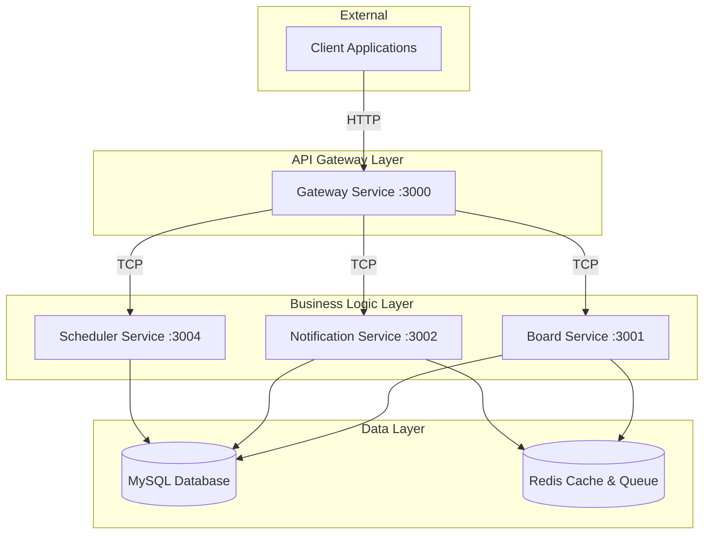

# Complete Project Structure - 전체 프로젝트 구조 분석

## 🎯 프로젝트 개요

**익명 게시판 및 키워드 알림 시스템**은 NestJS v11 기반의 마이크로서비스 아키텍처로 구현된 완전 자동화된 시스템입니다.

### 핵심 혁신 기술

- **🚀 Enhanced DB Sync System**: 완전 자동화된 Entity/Repository 생성
- **🛡️ 3단계 에러 방어 시스템**: 안전한 JSON 직렬화 및 예외 처리
- **📦 스마트 Import 관리**: 누락된 Import 자동 감지 및 추가
- **🔄 삭제된 테이블 감지**: @deprecated 주석 자동 추가로 하위 호환성 보장
- **⚡ SWC 컴파일러**: 15.6% 성능 향상

## 📁 전체 디렉토리 구조

```
toy-project/
├── 📱 apps/                          # 마이크로서비스 애플리케이션
│   ├── gateway/                      # API Gateway (Port: 3000)
│   │   ├── src/
│   │   │   ├── main.ts
│   │   │   ├── gateway.module.ts
│   │   │   ├── gateway.controller.ts
│   │   │   ├── board.controller.ts   # Board 서비스 프록시
│   │   │   └── health.controller.ts  # 헬스체크
│   │   └── test/                     # E2E 테스트
│   │
│   ├── board/                        # 게시판 서비스 (Port: 3001)
│   │   ├── src/
│   │   │   ├── main.ts
│   │   │   ├── board.module.ts
│   │   │   ├── board.controller.ts
│   │   │   └── board.service.ts
│   │   └── test/                     # 단위/E2E 테스트
│   │
│   ├── notification/                 # 알림 서비스 (Port: 3002)
│   │   ├── src/
│   │   │   ├── main.ts
│   │   │   ├── notification.module.ts
│   │   │   ├── notification.controller.ts
│   │   │   ├── notification.service.ts
│   │   │   ├── notification.processor.ts  # Bull Queue 처리
│   │   │   ├── dto/                       # 요청/응답 DTO
│   │   │   └── common/                    # 공통 유틸리티
│   │   └── test/
│   │
│   └── scheduler/                    # 스케줄러 서비스 (Port: 3004)
│       ├── src/
│       │   ├── main.ts
│       │   ├── scheduler.module.ts
│       │   ├── scheduler.controller.ts
│       │   ├── scheduler.service.ts
│       │   └── board/                # 게시판 관련 스케줄 작업
│       └── test/
│
├── 📚 libs/                          # 공유 라이브러리
│   ├── common/                       # 공통 유틸리티
│   │   └── src/
│   │       ├── constants/            # 상수 정의
│   │       ├── decorators/           # 커스텀 데코레이터
│   │       └── interceptors/         # 인터셉터
│   │
│   ├── core/                         # 핵심 기능
│   │   └── src/
│   │       ├── config/               # 설정 관리
│   │       ├── filter/               # 예외 필터
│   │       └── redis/                # Redis 연결
│   │
│   ├── database/                     # 데이터베이스 레이어 ⭐
│   │   └── src/
│   │       ├── entities/             # TypeORM Entity (자동 생성)
│   │       │   ├── tb-board.entity.ts
│   │       │   ├── tb-comment.entity.ts
│   │       │   ├── tb-user.entity.ts
│   │       │   ├── tb-notification.entity.ts
│   │       │   └── index.ts          # ALL_ENTITIES 배열
│   │       ├── repositories/         # Repository 패턴 (자동 생성)
│   │       │   ├── board.repository.ts
│   │       │   ├── comment.repository.ts
│   │       │   ├── tb-user.repository.ts
│   │       │   └── index.ts          # ALL_REPOSITORIES 배열
│   │       ├── services/             # 데이터베이스 서비스
│   │       │   └── enhanced-board.service.ts
│   │       ├── procedures/           # 저장 프로시저 (자동 추출)
│   │       │   ├── procedures/       # Stored Procedures
│   │       │   ├── functions/        # Functions
│   │       │   └── README.md         # 자동 생성 문서
│   │       ├── database.module.ts
│   │       └── database.service.ts
│   │
│   ├── global-dto/                   # 전역 DTO ⭐
│   │   └── src/
│   │       └── board/
│   │           ├── request/          # 요청 DTO
│   │           ├── response/         # 응답 DTO
│   │           └── query/            # 쿼리 결과 DTO
│   │
│   ├── notification/                 # 알림 라이브러리
│   │   └── src/
│   │       ├── interfaces/
│   │       ├── services/
│   │       └── notification.module.ts
│   │
│   ├── notification-client/          # 알림 클라이언트
│   │   └── src/
│   │       ├── notification-client.module.ts
│   │       └── notification-client.service.ts
│   │
│   ├── proxy/                        # 프록시 클라이언트
│   │   └── src/
│   │       └── common-proxy-client.ts
│   │
│   └── utility/                      # 유틸리티 함수
│       └── src/
│           ├── services/
│           └── utility.module.ts
│
├── 🔧 scripts/                       # 개발/운영 스크립트 ⭐
│   ├── db-analyzer/                  # Enhanced DB Sync System
│   │   ├── enhanced-db-sync.ts       # 메인 실행 파일
│   │   ├── enhanced-schema-analyzer.ts    # 스키마 분석기
│   │   ├── enhanced-entity-generator.ts   # Entity 생성기
│   │   ├── enhanced-repository-generator.ts # Repository 생성기
│   │   ├── procedure-extractor.ts    # 프로시저 추출기
│   │   ├── package.json              # 독립적인 의존성
│   │   └── README.md                 # 사용법 가이드
│   │
│   ├── run-enhanced-db-sync.sh       # DB 동기화 실행 스크립트
│   ├── create-schema.sql             # 데이터베이스 스키마
│   └── README.md                     # 스크립트 사용법
│
├── 🌍 env/                           # 환경별 설정
│   ├── dev.env                       # 개발 환경
│   ├── qa.env                        # QA 환경
│   └── prod.env                      # 운영 환경
│
├── 🚀 .github/                       # CI/CD 파이프라인
│   └── workflows/
│       ├── main-services-ci-cd.yml   # 메인 서비스 CI/CD
│       ├── scheduler-ci-cd.yml       # 스케줄러 CI/CD
│       └── db-sync.yml               # DB 동기화 자동화
│
├── 🐳 Docker 설정
│   ├── Dockerfile                    # 메인 Dockerfile
│   ├── Dockerfile.notification       # 알림 서비스용
│   ├── Dockerfile.scheduler          # 스케줄러용
│   ├── docker-compose.yml            # 전체 서비스
│   ├── docker-compose.notification.yml
│   ├── docker-compose.scheduler.yml
│   └── docker-compose.scheduler-notification.yml
│
├── 📚 ssot/                          # Single Source of Truth ⭐
│   ├── 00_README.md                  # 프로젝트 개요
│   ├── 00_SUMMARY.md                 # 요약
│   ├── 01_PRD.md                     # 제품 요구사항
│   ├── 01_System_Architecture.md     # 시스템 아키텍처
│   ├── 02_UserFlow.md                # 사용자 플로우
│   ├── 03_Database_Schema.md         # 데이터베이스 스키마
│   ├── 04_API_Interface.md           # API 인터페이스
│   ├── 05_Package_Management.md      # 패키지 관리
│   ├── 06_SWC_Build_System.md        # 빌드 시스템
│   ├── 07_Docker_Configuration.md    # Docker 설정
│   ├── 08_Enhanced_DB_Sync_System.md # DB 동기화 시스템 ⭐ NEW
│   └── 09_Complete_Project_Structure.md # 전체 구조 ⭐ NEW
│
├── 📝 설정 파일
│   ├── package.json                  # 프로젝트 의존성
│   ├── pnpm-lock.yaml               # pnpm 락 파일
│   ├── nest-cli.json                # NestJS CLI 설정
│   ├── tsconfig.json                # TypeScript 설정
│   ├── tsconfig.build.json          # 빌드용 TypeScript 설정
│   ├── jest.config.js               # Jest 테스트 설정
│   └── jest.setup.js                # Jest 셋업
│
└── 📋 logs/                          # 로그 파일
    ├── notification-service-*.log
    ├── notification-error-*.log
    ├── scheduler-*.log
    └── scheduler-error-*.log
```

## 🏗️ 마이크로서비스 아키텍처

### 서비스 구성

| 서비스           | 포트 | 역할          | 주요 기능                       |
| ---------------- | ---- | ------------- | ------------------------------- |
| **Gateway**      | 3000 | API Gateway   | 요청 라우팅, Swagger 문서, 인증 |
| **Board**        | 3001 | 게시판 서비스 | CRUD, 댓글 시스템, 키워드 매칭  |
| **Notification** | 3002 | 알림 서비스   | Slack/Email 알림, Bull Queue    |
| **Scheduler**    | 3004 | 스케줄러      | 정기 작업, 배치 처리            |

### 통신 방식



## 📦 라이브러리 구조

### 1. Database Layer (`libs/database`)

**핵심 특징**:

- **완전 자동화**: Enhanced DB Sync System으로 Entity/Repository 자동 생성
- **스마트 병합**: 기존 수동 코드 보존하며 스키마 변경사항만 반영
- **관계 매핑**: 외래키 기반 자동 관계 생성

**주요 파일**:

```typescript
// entities/index.ts - 자동 생성
export const ALL_ENTITIES = [
  TbBoardEntity,
  TbCommentEntity,
  TbUserEntity,
  TbNotificationEntity,
];

// repositories/index.ts - 자동 생성
export const ALL_REPOSITORIES = [
  BoardRepository,
  CommentRepository,
  TbUserRepository,
  TbNotificationRepository,
];
```

### 2. Global DTO (`libs/global-dto`)

**구조**:

```
global-dto/src/board/
├── request/     # 요청 DTO
├── response/    # 응답 DTO
└── query/       # 쿼리 결과 DTO (DB 직접 쿼리 결과)
```

**특징**:

- 모든 DTO에 `@Type` 데코레이터 적용
- 런타임 타입 검증 및 변환
- 중앙 집중식 타입 관리

### 3. Common Libraries

- **`libs/common`**: 공통 유틸리티, 데코레이터, 인터셉터
- **`libs/core`**: 핵심 기능 (설정, 필터, Redis)
- **`libs/notification`**: 알림 시스템 라이브러리
- **`libs/proxy`**: 마이크로서비스 간 통신 클라이언트
- **`libs/utility`**: 범용 유틸리티 함수

## 🚀 Enhanced DB Sync System

### 핵심 혁신

**1. 완전 자동화된 워크플로우**

```bash
DB Schema → Analysis → Entity Generation → Repository Creation → Index Update
```

**2. 스마트 병합 시스템**

- 기존 수동 코드 보존
- 스키마 변경사항만 반영
- Import 자동 관리

**3. 삭제된 테이블 감지**

- `@deprecated` 주석 자동 추가
- 하위 호환성 보장
- 안전한 마이그레이션

### 실행 방법

```bash
# 기본 실행 (병합 모드)
./scripts/run-enhanced-db-sync.sh dev

# 강제 재생성
./scripts/run-enhanced-db-sync.sh dev --overwrite

# 테스트 실행
./scripts/run-enhanced-db-sync.sh dev --dry-run
```

## 🔧 개발 도구 및 스크립트

### 1. 데이터베이스 관리

- **`scripts/run-enhanced-db-sync.sh`**: DB 동기화 메인 스크립트
- **`scripts/create-schema.sql`**: 데이터베이스 스키마 정의
- **`scripts/db-analyzer/`**: Enhanced DB Sync System 구현체

### 2. 서비스 실행 스크립트

```bash
# 개별 서비스 실행
./scripts/run-gateway.sh      # Gateway 서비스
./scripts/run-board.sh        # Board 서비스
./scripts/run-notification.sh # Notification 서비스
./scripts/run-scheduler.sh    # Scheduler 서비스
```

### 3. Docker 관리

```bash
# 전체 서비스
docker-compose up

# 특정 조합
docker-compose -f docker-compose.scheduler-notification.yml up
```

## 🌍 환경 관리

### 환경별 설정

- **`env/dev.env`**: 개발 환경 (DB: public)
- **`env/qa.env`**: QA 환경
- **`env/prod.env`**: 운영 환경

### 주요 환경 변수

```bash
# 데이터베이스
DB_HOST=localhost
DB_PORT=3306
DB_USERNAME=root
DB_PASSWORD=
DB_DATABASE=public
DB_SYNC=false

# 서비스 포트
GATEWAY_SERVICE_PORT=3000
BOARD_SERVICE_PORT=3001
NOTIFICATION_SERVICE_PORT=3002
SCHEDULER_SERVICE_PORT=3004

# Redis
REDIS_HOST=localhost
REDIS_PORT=6379

# 외부 서비스
SLACK_WEBHOOK_URL=...
SENTRY_DSN_DEV=...
```

## 🚀 CI/CD 파이프라인

### GitHub Actions 워크플로우

1. **`main-services-ci-cd.yml`**: 메인 서비스 (Gateway, Board, Notification)
2. **`scheduler-ci-cd.yml`**: 스케줄러 서비스
3. **`db-sync.yml`**: 데이터베이스 동기화 자동화

### 배포 브랜치

- **`dev`**: 개발 환경 자동 배포
- **`qa`**: QA 환경 자동 배포
- **`production`**: 운영 환경 자동 배포

## 📊 성능 최적화

### 1. 빌드 시스템

- **SWC 컴파일러**: 15.6% 성능 향상
- **pnpm v8**: 빠른 패키지 관리
- **TypeScript 5.1.3**: 최신 타입 시스템

### 2. 런타임 최적화

- **Node.js v22**: LTS 버전 사용
- **Redis 캐싱**: 빠른 데이터 액세스
- **Bull Queue**: 비동기 작업 처리

### 3. 데이터베이스 최적화

- **인덱스 자동 생성**: Enhanced DB Sync가 DB 인덱스 자동 매핑
- **관계 최적화**: 외래키 기반 효율적인 JOIN
- **Connection Pooling**: TypeORM 연결 풀 관리

## 🛡️ 보안 및 안정성

### 1. 에러 처리

- **3단계 방어 시스템**: 안전한 JSON 직렬화
- **Global Exception Filter**: 통합 예외 처리
- **Sentry 연동**: 실시간 에러 모니터링

### 2. 타입 안전성

- **완전한 타입 커버리지**: 모든 DTO에 타입 적용
- **런타임 검증**: class-validator 활용
- **메타데이터 활용**: TypeScript 메타데이터 기반 자동화

### 3. 데이터 무결성

- **CASCADE 삭제**: 관계 데이터 자동 정리
- **트랜잭션 관리**: 데이터 일관성 보장
- **백업 시스템**: Enhanced DB Sync 실행 전 자동 백업

## 🎯 개발 워크플로우

### 1. 새로운 테이블 추가

```bash
# 1. DB에 테이블 생성
mysql> CREATE TABLE tb_new_feature (...);

# 2. Enhanced DB Sync 실행
./scripts/run-enhanced-db-sync.sh dev

# 3. 자동 생성된 Entity/Repository 확인
# - libs/database/src/entities/tb-new-feature.entity.ts
# - libs/database/src/repositories/tb-new-feature.repository.ts
```

### 2. 기존 테이블 수정

```bash
# 1. DB 스키마 변경
mysql> ALTER TABLE tb_board ADD COLUMN new_field VARCHAR(100);

# 2. Enhanced DB Sync 실행 (병합 모드)
./scripts/run-enhanced-db-sync.sh dev

# 3. 기존 수동 코드는 보존되고 새 필드만 추가됨
```

### 3. 테이블 삭제

```bash
# 1. DB에서 테이블 삭제
mysql> DROP TABLE tb_old_table;

# 2. Enhanced DB Sync 실행
./scripts/run-enhanced-db-sync.sh dev

# 3. 해당 Entity에 @deprecated 주석 자동 추가
```

## 📈 모니터링 및 로깅

### 1. 로그 시스템

- **구조화된 로깅**: JSON 형태 로그 출력
- **로그 레벨**: debug, info, warn, error
- **파일 로테이션**: 일별 로그 파일 분리

### 2. 헬스체크

```typescript
// Gateway 서비스 헬스체크
@Get('health')
healthCheck() {
  return {
    status: 'ok',
    timestamp: new Date().toISOString(),
    services: {
      board: 'healthy',
      notification: 'healthy',
      scheduler: 'healthy'
    }
  };
}
```

### 3. 메트릭 수집

- **응답 시간**: API 응답 시간 측정
- **에러율**: 서비스별 에러 발생률
- **처리량**: 초당 요청 처리 수

## 🔮 향후 확장 계획

### 1. 기술적 개선

- **GraphQL 지원**: REST API와 함께 GraphQL 엔드포인트 제공
- **gRPC 통신**: 마이크로서비스 간 고성능 통신
- **Kubernetes 배포**: 컨테이너 오케스트레이션

### 2. 기능 확장

- **실시간 채팅**: WebSocket 기반 실시간 통신
- **파일 업로드**: 이미지/첨부파일 지원
- **검색 엔진**: Elasticsearch 연동 고급 검색

### 3. 운영 개선

- **자동 스케일링**: 부하에 따른 자동 확장
- **A/B 테스팅**: 기능 플래그 기반 실험
- **성능 모니터링**: APM 도구 연동

---

> 🚀 **Complete Project Structure** - 체계적이고 확장 가능한 마이크로서비스 아키텍처로 구현된 현대적인 웹 애플리케이션
